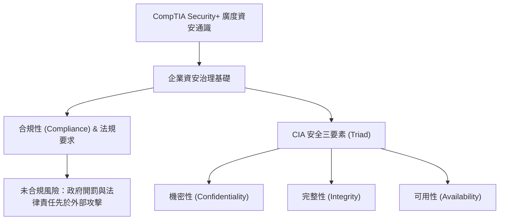

# 🛡️ SECPLUS-01-01-10 CompTIA Security+ Lesson 01 頁01~10：資安核心範疇、合規性與CIA三要素

> **課程主題**：CompTIA Security+ 認證核心定位、資安合規性法規與 CIA 三要素  
> **授課講師**：授課講師（資安與網路認證原廠認證講師）  
> **核心模組**：CompTIA Security+ Topic 1: Security Fundamentals  
> **學習目標**：理解資安通識全貌、掌握合規性法規要求與 CIA 三大支柱  
> **關聯文件**：[📄 完整原話逐字稿 (SecurityPlus-Lesson01-01-10-資安核心範疇與合規性導論-proofread.md)](./SecurityPlus-Lesson01-01-10-資安核心範疇與合規性導論-proofread.md)

---

## 🏛️ 核心架構與概念流轉圖

---

## 🔑 重點提要 (Key Takeaways)

1. **認證學習定位**：CompTIA Security+ 為廣泛涉獵各資安領域之通識認證，適合全盤了解後再深入特定領域（如法規合規、滲透測試、安全維運）。
2. **合規性重要性**：資安首重 Compliance。在受到駭客威脅前，若不符合政府法規要求，企業將面臨直接罰則。
3. **CIA 三要素平衡**：安全防護不能盲目加強，必須在保護資產機密與完整的同時，確保業務系統之可用性。
