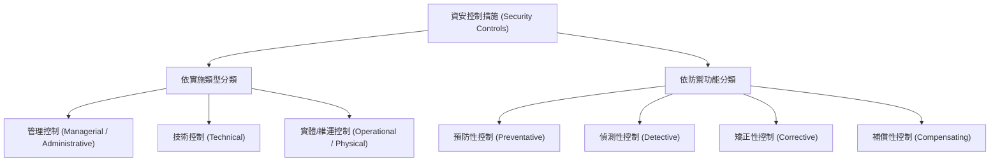

# 🛡️ SECPLUS-01-12-16 CompTIA Security+ Lesson 01 頁12~16：資安控制措施分類、縱深防禦與安全評估

> **課程主題**：安全控制措施（Security Controls）分類法與縱深防禦架構  
> **授課講師**：授課講師（資安與網路認證原廠認證講師）  
> **核心模組**：CompTIA Security+ Topic 1: Security Controls & Defense-in-Depth  
> **學習目標**：區分技術、管理、實體控制，掌握預防、偵測、矯正等控制功能  
> **關聯文件**：[📄 完整原話逐字稿 (SecurityPlus-Lesson01-12-16-控制措施分類與防禦深度評估-proofread.md)](./SecurityPlus-Lesson01-12-16-控制措施分類與防禦深度評估-proofread.md)

---

## 🏛️ 核心架構與概念流轉圖

---

## 🔑 重點提要 (Key Takeaways)

1. **控制類型三面向**：管理（規章政策）、技術（防火牆、加密、ACL）、實體（門禁、監視器、警衛）。
2. **縱深防禦原則**：單一層面被突破時，後續控制措施必須能立即承接，杜絕單點故障（SPOF）。
