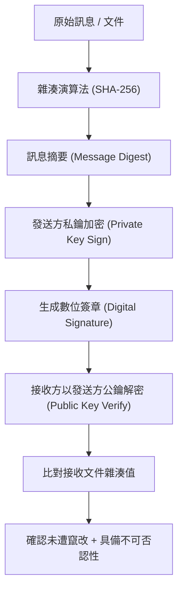

# 🛡️ SECPLUS-03-15-17 CompTIA Security+ Lesson 03 頁15~17：雜湊演算法、不可否認性與數位簽章驗證

> **課程主題**：雜湊函數（Hashing）、數位簽章驗證與不可否認性架構  
> **授課講師**：授課講師（資安與網路認證原廠認證講師）  
> **核心模組**：CompTIA Security+ Topic 3: Hashes & Digital Signatures  
> **學習目標**：掌握 SHA-2/3 演算法、數位簽章私鑰簽章/公鑰驗證原理與防篡改機制  
> **關聯文件**：[📄 完整原話逐字稿 (SecurityPlus-Lesson03-15-17-數位簽章與雜湊演算法完整性-proofread.md)](./SecurityPlus-Lesson03-15-17-數位簽章與雜湊演算法完整性-proofread.md)

---

## 🏛️ 核心架構與概念流轉圖

---

## 🔑 重點提要 (Key Takeaways)

1. **雜湊單向性**：雜湊不可逆，雪崩效應（Avalanche Effect）保證原始資料些微更動即造成摘要劇烈變化。
2. **數位簽章雙重保障**：同時提供資料完整性（Integrity）與發送方身分之不可否認性（Non-Repudiation）。
