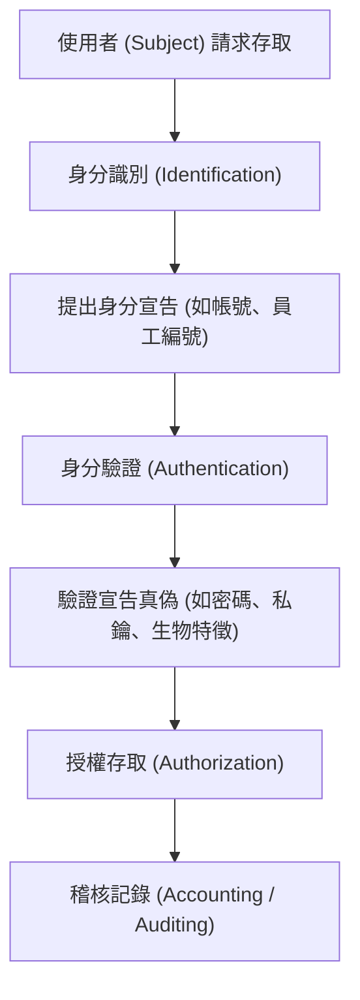

# 🛡️ SECPLUS-04-01-09 CompTIA Security+ Lesson 04 頁01~09：身分識別、鑑別與密碼管理原則

> **課程主題**：身分識別與存取管理（IAM）、驗證概念與企業密碼原則  
> **授課講師**：授課講師（資安與網路認證原廠認證講師）  
> **核心模組**：CompTIA Security+ Topic 4: Identity & Access Management Fundamentals  
> **學習目標**：釐清 Identification 與 Authentication 差異，掌握企業密碼策略  
> **關聯文件**：[📄 完整原話逐字稿 (SecurityPlus-Lesson04-01-09-身分鑑別與存取管理IAM架構-proofread.md)](./SecurityPlus-Lesson04-01-09-身分鑑別與存取管理IAM架構-proofread.md)

---

## 🏛️ 核心架構與概念流轉圖

---

## 🔑 重點提要 (Key Takeaways)

1. **IAM 核心四步驟（IAAA）**：識別（Who you are）、鑑別（Prove it）、授權（What you can do）、稽核（What you did）。
2. **密碼策略實務**：單純提高複雜度易導致便利性反噬（如貼便條紙），現代密碼策略更推崇足夠長度（Passphrase）與防暴力破解鎖定機制。
