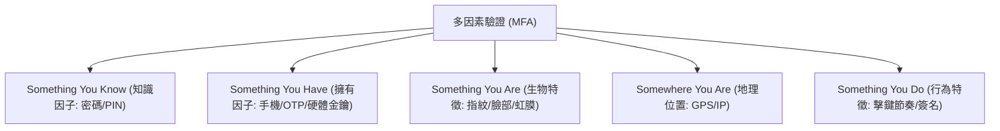

# 🛡️ SECPLUS-04-18-26 CompTIA Security+ Lesson 04 頁18~26：多因素驗證（MFA）、生物特徵識別與實體權杖

> **課程主題**：多因素驗證（MFA）分類、生物辨識效能評估與硬體金鑰  
> **授課講師**：授課講師（資安與網路認證原廠認證講師）  
> **核心模組**：CompTIA Security+ Topic 4: MFA & Biometric Authentication  
> **學習目標**：理解 MFA 各項要素、掌握 FAR/FRR 權衡與無密碼 FIDO2 趨勢  
> **關聯文件**：[📄 完整原話逐字稿 (SecurityPlus-Lesson04-18-26-多因素驗證MFA與生物辨識技術-proofread.md)](./SecurityPlus-Lesson04-18-26-多因素驗證MFA與生物辨識技術-proofread.md)

---

## 🏛️ 核心架構與概念流轉圖

---

## 🔑 重點提要 (Key Takeaways)

1. **真正 MFA 定義**：必須跨越「不同因子類別」。輸入兩組密碼不是 MFA，密碼搭配手機 Authenticator App 才是 MFA。
2. **生物辨識指標 CER**：錯誤接受率（FAR）與錯誤拒絕率（FRR）的交會點即為 Crossover Error Rate (CER)，CER 愈低代表系統整體精確度愈高。
