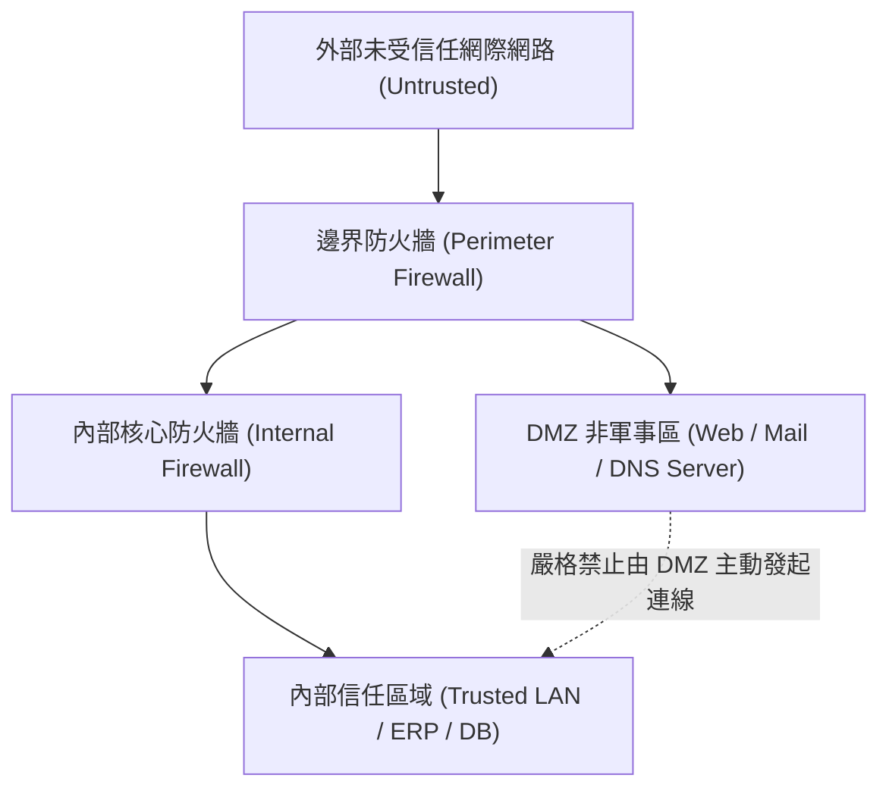

# 🛡️ SECPLUS-05-01-08 CompTIA Security+ Lesson 05 頁01~08：企業園區網路架構、安全區域規劃與邊界隔離

> **課程主題**：在地網路安全拓撲、DMZ 邊界規劃與 VLAN 微區段隔離  
> **授課講師**：授課講師（資安與網路認證原廠認證講師）  
> **核心模組**：CompTIA Security+ Topic 5: Network Architecture & Segmentation  
> **學習目標**：掌握對外公開伺服器 DMZ 配置、內部機敏網段隔離與二層攻擊防禦  
> **關聯文件**：[📄 完整原話逐字稿 (SecurityPlus-Lesson05-01-08-園區網路架構與安全區域規劃-proofread.md)](./SecurityPlus-Lesson05-01-08-園區網路架構與安全區域規劃-proofread.md)

---

## 🏛️ 核心架構與概念流轉圖

---

## 🔑 重點提要 (Key Takeaways)

1. **DMZ 設計原則**：所有對外提供公開服務之主機皆應置於 DMZ，即使被攻陷亦無法橫向滲透內部資料庫。
2. **網路分段（Segmentation）**：利用 VLAN 與子網劃分將財務、人資、研發與訪客網路隔離，阻斷勒索軟體橫向傳播。
