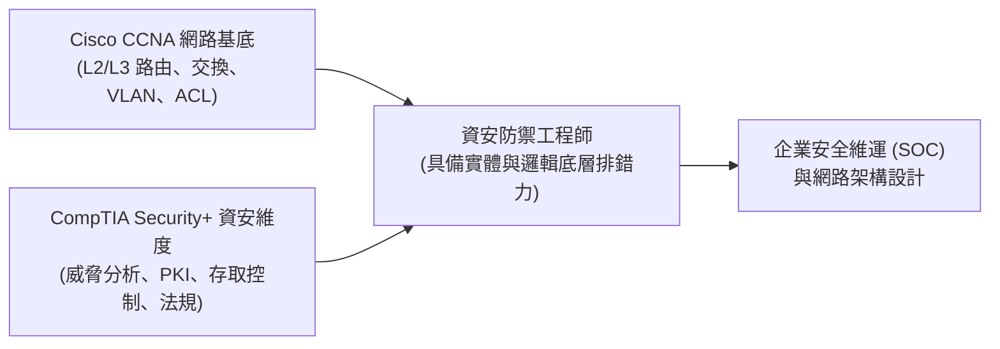

# 🛡️ SEC-05A CompTIA Security+ Lesson 05 Part 1：認證備考策略、CCNA/Security+ 雙軌聯防與安全架構

> **課程主題**：CCNA 網路基礎與 Security+ 資安專業雙認證之職涯發展與備考路徑  
> **授課講師**：授課講師（資安與網路認證原廠認證講師）  
> **核心模組**：CompTIA Security+ Domain 1 & 2: General Security Concepts & Network Architecture  
> **學習目標**：建立網工與資安雙視角，掌握考照時間規劃與網路安全一體化思維  
> **關聯文件**：[📄 完整原話逐字稿 (SecurityPlus-Lesson05A-認證備考與雙軌防禦-proofread.md)](./SecurityPlus-Lesson05A-認證備考與雙軌防禦-proofread.md)

---

## 🏛️ 核心架構與概念流轉圖

---

## 🔬 技術精華與核心考點解析

### CCNA 與 Security+ 的互補關係

- 資安不能脫離網路空談：不懂 IP 路由、TCP 三次交握、VLAN 切分與封包結構，就無法分析攻擊流量與防火牆日誌。
- CCNA 提供堅實的底層連線與設備配置能力，Security+ 則補足密碼學、威脅情資、存取控制及法規遵循的全局視野。

### 密集培訓之考試應對節奏

- 課後應趁記憶猶新在 2-4 週內完成預約與測驗，避免因工作繁忙遺忘細節。
- 原廠考試費用較高，應以一次考取為目標，多做原廠官方 Practice Test 檢視弱點領域。

---

## 💡 關鍵總結與考試應對重點

1. **在資安履歷上，同時具備 CCNA + Security+ 認證是跨入大型企業 SOC 或網安工程師的最佳敲門磚。**
1. **遇到題幹中涉及網路通訊協定的資安題目時，先以 CCNA 的封包流向思考，再套用 Security+ 的防護控制措施。**
