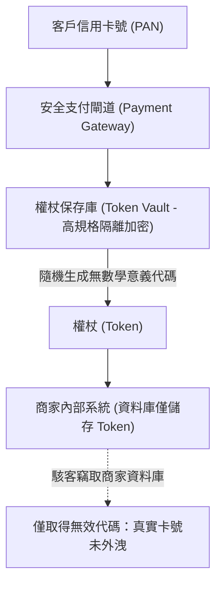

# 🛡️ SECPLUS-06-21-27 CompTIA Security+ Lesson 06 頁21~27：資料遮蔽、權杖化技術與隱寫術（Steganography）

> **課程主題**：資訊隱寫術（Steganography）、資料遮蔽與權杖化（Tokenization）  
> **授課講師**：授課講師（資安與網路認證原廠認證講師）  
> **核心模組**：CompTIA Security+ Topic 6: Data Obfuscation & Steganography  
> **學習目標**：識別機敏資料外洩之隱寫通道、掌握資料遮蔽手法與 PCI DSS 權杖化機制  
> **關聯文件**：[📄 完整原話逐字稿 (SecurityPlus-Lesson06-21-27-資料隱碼混淆與隱寫術防護-proofread.md)](./SecurityPlus-Lesson06-21-27-資料隱碼混淆與隱寫術防護-proofread.md)

---

## 🏛️ 核心架構與概念流轉圖

---

## 🔑 重點提要 (Key Takeaways)

1. **權杖化（Tokenization） vs. 加密**：加密可透過演算法與金鑰解回明文；權杖化是由隨機代碼對應資料庫，代碼本身毫無數學可逆性，大幅縮小 PCI DSS 稽核範圍。
2. **隱寫術偵測**：隱寫術常被攻擊者用於機敏資料外洩（Exfiltration）或惡意酬載載入，需仰賴行為分析與異常雜湊檢測。
