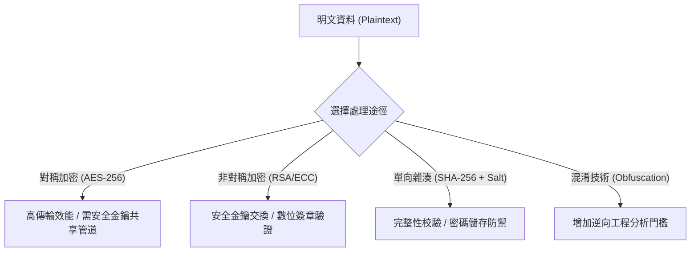

# 🛡️ SEC-06 CompTIA Security+ Lesson 06：密碼學原理、演算法安全性與資料混淆防護

> **課程主題**：現代密碼學核心演算、資料完整性驗證與代碼混淆防禦  
> **授課講師**：授課講師（資安與網路認證原廠認證講師）  
> **核心模組**：CompTIA Security+ Domain 2: Cryptography & Obfuscation  
> **學習目標**：掌握對稱/非對稱加密速度與金鑰分發平衡、雜湊碰撞防禦與資料保護標準  
> **關聯文件**：[📄 完整原話逐字稿 (SecurityPlus-Lesson06-密碼學與資料混淆-proofread.md)](./SecurityPlus-Lesson06-密碼學與資料混淆-proofread.md)

---

## 🏛️ 核心架構與概念流轉圖

---

## 🔬 技術精華與核心考點解析

### 對稱與非對稱加密之混合體系

- 對稱加密（如 AES）：運算極快，適合大量資料與磁碟加密，但金鑰分發是難題。
- 非對稱加密（如 RSA、ECC）：運算開銷大，適合數位簽章與金鑰協商（如 TLS 握手）。
- 混合加密（Hybrid Encryption）：實務上 TLS/HTTPS 先用非對稱加密協商對稱 Session Key，再用對稱加密傳輸網頁資料。

### 雜湊運算與加鹽（Salting）

- 雜湊不可逆，雪崩效應（Avalanche Effect）強烈。
- 單純 MD5 / SHA-1 已遭破解碰撞；儲存密碼必須加上隨機 Salt 並使用慢速演算法（bcrypt / PBKDF2 / Argon2）以抵禦 Rainbow Table 與 GPU 暴力破解。

---

## 💡 關鍵總結與考試應對重點

1. **DES / 3DES / RC4 / MD5 / SHA-1 在 Security+ 考試中皆被歸類為『棄用與不安全演算法』，見到請直接排除。**
1. **ECC（橢圓曲線密碼學）相較於 RSA 具備『更小金鑰長度達到同等或更高安全強度』之優勢，極適合行動裝置與物聯網。**
