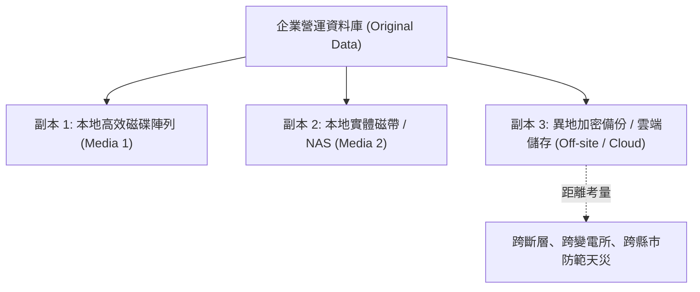

# 🛡️ SECPLUS-07-06-17 CompTIA Security+ Lesson 07 頁06~17：3-2-1 備份黃金原則、異地備援距離與加密實務

> **課程主題**：3-2-1 備份原則、異地實體距離規劃與機敏備份加密保護  
> **授課講師**：授課講師（資安與網路認證原廠認證講師）  
> **核心模組**：CompTIA Security+ Topic 7: Backup Strategies & Redundancy  
> **學習目標**：落實 3-2-1 備份拓撲、理解區域性災害對異地距離之要求與加密存放  
> **關聯文件**：[📄 完整原話逐字稿 (SecurityPlus-Lesson07-06-17-三二一備份原則與異地備援-proofread.md)](./SecurityPlus-Lesson07-06-17-三二一備份原則與異地備援-proofread.md)

---

## 🏛️ 核心架構與概念流轉圖

---

## 🔑 重點提要 (Key Takeaways)

1. **3-2-1 現代化延伸（3-2-1-1-0）**：加碼 1 份離線/不可變（Air-gapped / Immutable）副本，以及 0 個備份還原錯誤驗證。
2. **異地備援距離**：兩地距離不能僅設在同一園區隔壁棟，須考量地震、停電或淹水等區域天災，確保至少跨電網/跨地理區域。
