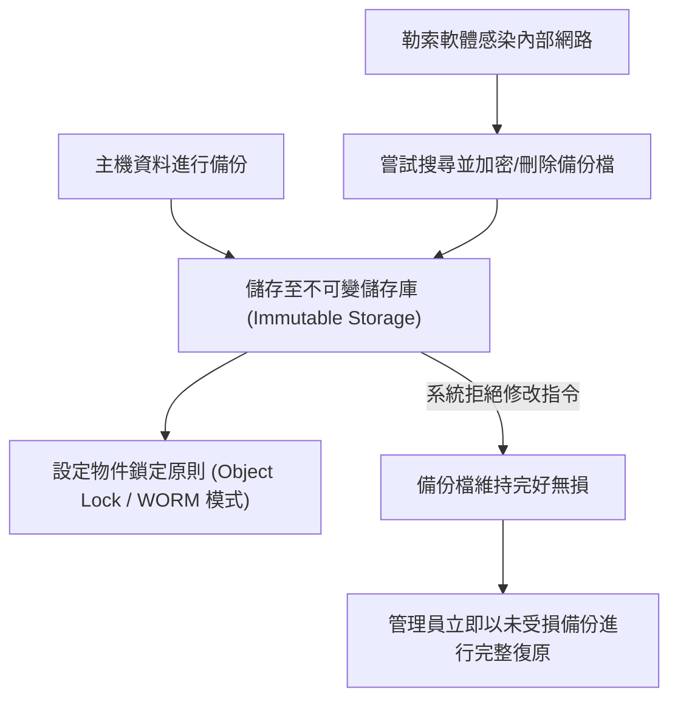

# 🛡️ SECPLUS-07-31-40 CompTIA Security+ Lesson 07 頁31~40：快照技術、不可變備份（WORM）與勒索軟體防禦演練

> **課程主題**：不可變儲存（Immutable Backups）、快照機制與定期復原演練  
> **授課講師**：授課講師（資安與網路認證原廠認證講師）  
> **核心模組**：CompTIA Security+ Topic 7: Immutable Backups & Ransomware Defense  
> **學習目標**：防範勒索軟體破壞備份檔、建立 Write Once Read Many (WORM) 保護並落實驗證  
> **關聯文件**：[📄 完整原話逐字稿 (SecurityPlus-Lesson07-31-40-不可變備份與系統快照驗證演練-proofread.md)](./SecurityPlus-Lesson07-31-40-不可變備份與系統快照驗證演練-proofread.md)

---

## 🏛️ 核心架構與概念流轉圖

---

## 🔑 重點提要 (Key Takeaways)

1. **不可變備份抗勒索**：現代勒索軟體會先潛伏並尋找備份系統刪除之。啟用 WORM 或 S3 Object Lock 確保即使擁有最高管理員權限也無法在設定期限內刪除或竄改。
2. **驗證勝於備份**：沒有經過成功還原測試的備份等於不存在，企業必須排程模擬災害演練確認資料可用。
