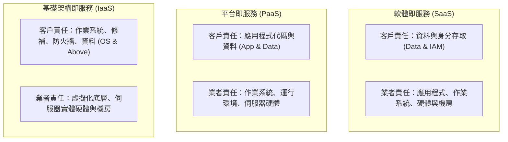

# 🛡️ SECPLUS-08-11-13 CompTIA Security+ Lesson 08 頁11~13：雲端運算架構、共享責任模型（SRM）與安全配置

> **課程主題**：雲端運算服務架構、共享責任模型（SRM）與企業雲端安全控管  
> **授課講師**：授課講師（資安與網路認證原廠認證講師）  
> **核心模組**：CompTIA Security+ Topic 8: Cloud Models & Shared Responsibility  
> **學習目標**：釐清 IaaS/PaaS/SaaS 責任歸屬、掌握 CASB/CSPM 雲端合規監控  
> **關聯文件**：[📄 完整原話逐字稿 (SecurityPlus-Lesson08-11-13-雲端共享責任模型與服務架構-proofread.md)](./SecurityPlus-Lesson08-11-13-雲端共享責任模型與服務架構-proofread.md)

---

## 🏛️ 核心架構與概念流轉圖

---

## 🔑 重點提要 (Key Takeaways)

1. **資料責任永遠在客戶**：無論使用 IaaS、PaaS 還是 SaaS，資料擁有權與法規合規性責任永遠歸屬於客戶企業本身。
2. **CASB 守門員角色**：雲端存取安全性代理（CASB）作為地端與雲端間的受控閘道，負責強制執行 DLP、身分認證與威脅防禦。
