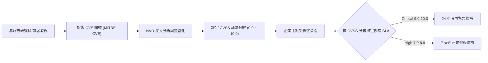

# 🛡️ SECPLUS-08-29-36 CompTIA Security+ Lesson 08 頁29~36：弱點管理架構、CVE/NVD 資料庫與 CVSS 風險評分

> **課程主題**：弱點管理生命週期、CVE/NVD 資料庫與 CVSS 風險指標計算  
> **授課講師**：授課講師（資安與網路認證原廠認證講師）  
> **核心模組**：CompTIA Security+ Topic 8: Vulnerability Management & CVSS  
> **學習目標**：理解 CVE 識別碼體系、解讀 CVSS 向量字串並排定修補優先權  
> **關聯文件**：[📄 完整原話逐字稿 (SecurityPlus-Lesson08-29-36-弱點評估架構與CVE資料庫-proofread.md)](./SecurityPlus-Lesson08-29-36-弱點評估架構與CVE資料庫-proofread.md)

---

## 🏛️ 核心架構與概念流轉圖

---

## 🔑 重點提要 (Key Takeaways)

1. **CVSS 指標三維度**：Base Metrics（固有弱點本質）、Temporal Metrics（是否有 Exploit 武器化流傳）、Environmental Metrics（在特定企業內之實際影響）。
2. **CWE vs. CVE**：CWE 為弱點型態分類（如 SQL Injection、Buffer Overflow）；CVE 則是特定軟體特定版本上的具體具名漏洞。
