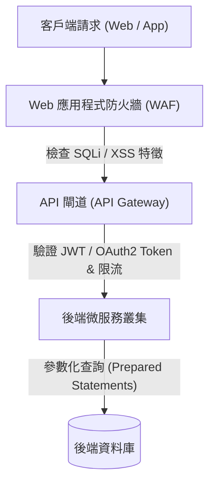

# 🛡️ SEC-08 CompTIA Security+ Lesson 08：雲端應用程式安全、攻擊防禦與 API 防護

> **課程主題**：雲端應用程式威脅防護、API 漏洞防禦與雲端安全架構  
> **授課講師**：授課講師（資安與網路認證原廠認證講師）  
> **核心模組**：CompTIA Security+ Domain 1 & 2: Application Attacks & Cloud Security  
> **學習目標**：掌握 OWASP Top 10 Web 漏洞防禦、API 存取控制與雲端責任共擔原則  
> **關聯文件**：[📄 完整原話逐字稿 (SecurityPlus-Lesson08-雲端應用安全與API防護-proofread.md)](./SecurityPlus-Lesson08-雲端應用安全與API防護-proofread.md)

---

## 🏛️ 核心架構與概念流轉圖

---

## 🔬 技術精華與核心考點解析

### 常見應用程式攻擊防禦

- SQL 注入（SQLi）：防禦最有效手段為參數化查詢（Prepared Statements / Parameterized Queries），嚴禁字串拼接 SQL 指令。
- 跨站腳本（XSS）：防禦手段包含輸入驗證、輸出編碼（Output Encoding）及設定 Content Security Policy (CSP)。

### API 介面防護規範

- API 必須實施強身分驗證（OAuth 2.0 / JWT），避免使用寫死在前端的 API Key。
- 速率限制（Rate Limiting / Throttling）：防止暴力密碼猜解與 DoS 耗盡攻擊。

### 雲端責任共擔模型

- IaaS：客戶負責作業系統、應用程式與資料；雲端商負責實體設施與虛擬化層。
- PaaS：客戶負責應用程式與資料；雲端商負責底層 OS、執行環境與硬體。
- SaaS：客戶僅負責資料與使用者身分存取控制；雲端商包辦全套服務維運。

---

## 💡 關鍵總結與考試應對重點

1. **考試常考：防範 SQL 注入的最佳解法永遠首選『Prepared Statements』。**
1. **雲端責任共擔模型中，『資料本身（Data）的所有權與保密責任』在任何服務模式（IaaS/PaaS/SaaS）下永遠由客戶端 100% 承擔！**
