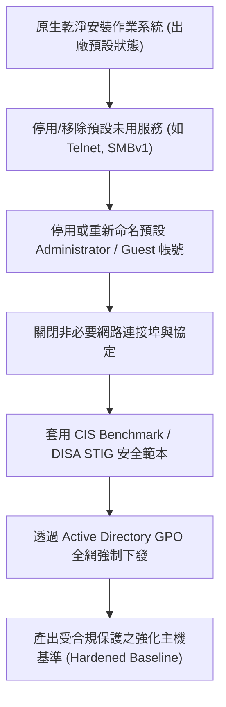

# 🛡️ SECPLUS-09-04-20 CompTIA Security+ Lesson 09 頁04~20：作業系統安全強化（Hardening）、服務停用與基準配置

> **課程主題**：作業系統強化（OS Hardening）、服務最小化與 CIS 安全基準  
> **授課講師**：授課講師（資安與網路認證原廠認證講師）  
> **核心模組**：CompTIA Security+ Topic 9: Host Hardening & Baselines  
> **學習目標**：停用多餘服務、改寫不安全預設值，利用 GPO 落實企業安全 Baseline  
> **關聯文件**：[📄 完整原話逐字稿 (SecurityPlus-Lesson09-04-20-主機安全強化與作業系統基準-proofread.md)](./SecurityPlus-Lesson09-04-20-主機安全強化與作業系統基準-proofread.md)

---

## 🏛️ 核心架構與概念流轉圖

---

## 🔑 重點提要 (Key Takeaways)

1. **預設安全（Secure by Default）**：絕不保留任何預設密碼、示範帳號或預設開放的管理埠號。
2. **CIS Benchmarks**：網路安全中心（CIS）發布的指引為國際公認之作業系統安全強化權威標準，可直接量化主機合規程度。
