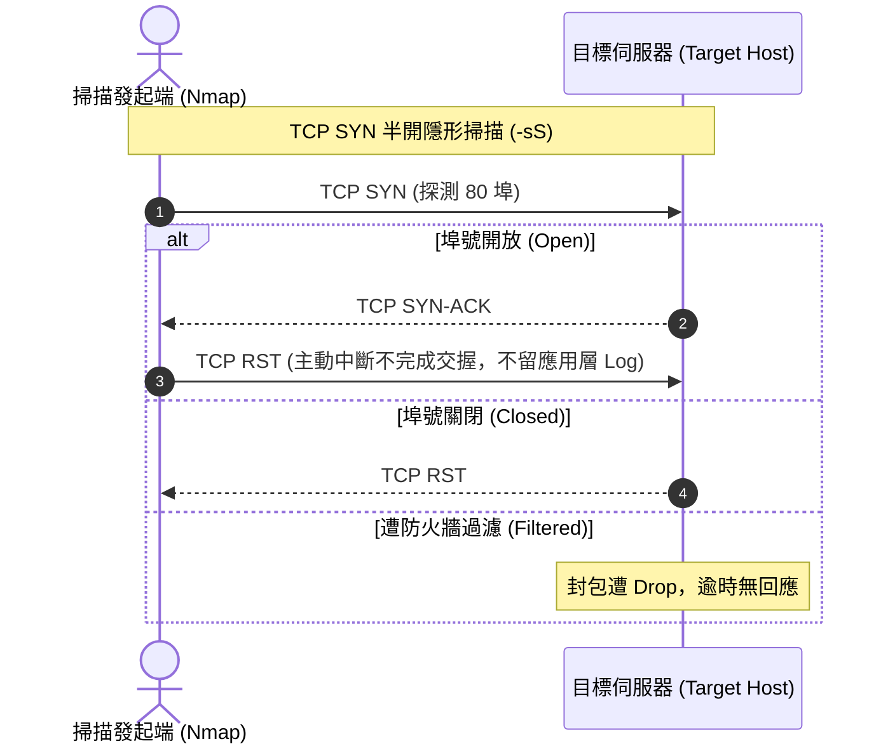

# 🛡️ SECPLUS-11-04-09 CompTIA Security+ Lesson 11 頁04~09：網路偵察（Reconnaissance）、Nmap 掃描技術與服務指紋識別

> **課程主題**：主動/被動偵察手法、Nmap 掃描參數原理與作業系統指紋探測  
> **授課講師**：授課講師（資安與網路認證原廠認證講師）  
> **核心模組**：CompTIA Security+ Topic 11: Reconnaissance & Nmap Scanning  
> **學習目標**：熟練 Nmap 常用參數語法、掌握 TCP 半開放掃描（SYN Scan）與防火牆規避  
> **關聯文件**：[📄 完整原話逐字稿 (SecurityPlus-Lesson11-04-09-網路偵察技術與Nmap掃描實戰-proofread.md)](./SecurityPlus-Lesson11-04-09-網路偵察技術與Nmap掃描實戰-proofread.md)

---

## 🏛️ 核心架構與概念流轉圖

---

## 🔑 重點提要 (Key Takeaways)

1. **主動 vs. 被動偵察**：被動偵察（Whois、DNS、OSINT、社群網路）不直接碰觸目標主機，無日誌紀錄；主動偵察（Nmap、Ping sweep）封包直接抵達目標，極易觸發 IDS 告警。
2. **SYN Stealth 掃描優勢**：發送 RST 中斷三次交握，避免建立正式 TCP 連線，從而在傳統 Web 應用程式日誌中不留痕跡。
