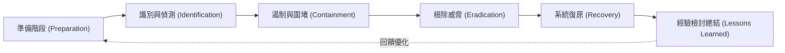

# 🛡️ SECPLUS-12-37-43 CompTIA Security+ Lesson 12 頁37~43：事件應變生命週期（PICERL）、遏制根除與證據監管鏈

> **課程主題**：事件應變生命週期（PICERL）、遏制與根除處置、數位鑑識證據保全  
> **授課講師**：授課講師（資安與網路認證原廠認證講師）  
> **核心模組**：CompTIA Security+ Topic 12: Incident Response & Digital Forensics  
> **學習目標**：熟悉事件應變標準作業程序、掌握證據揮發性順序與法律監管鏈要求  
> **關聯文件**：[📄 完整原話逐字稿 (SecurityPlus-Lesson12-37-43-資安事件應變流程與數位鑑識原則-proofread.md)](./SecurityPlus-Lesson12-37-43-資安事件應變流程與數位鑑識原則-proofread.md)

---

## 🏛️ 核心架構與概念流轉圖

---

## 🔑 重點提要 (Key Takeaways)

1. **證據揮發性順序（Order of Volatility）**：由最易消失至最持久：CPU 快取/暫存器 $	o$ 實體記憶體（RAM） $	o$ 網路狀態/核心快取 $	o$ 磁碟儲存 $	o$ 遠端日誌 $	o$ 實體備份。拔插頭前務必先做記憶體傾印！
2. **監管鏈（Chain of Custody）**：記載何人、何時、何因接觸過該數位證物，中途不得有斷裂，否則法院將判定證物失效不可採信。
