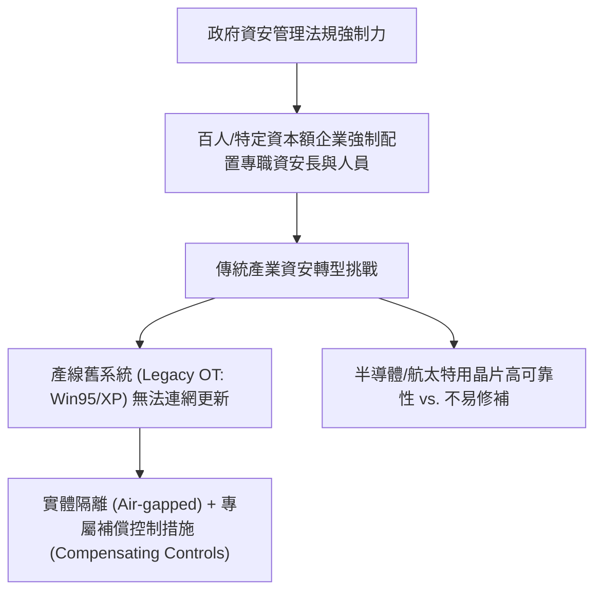

# 🛡️ SECPLUS-13-01-06 CompTIA Security+ Lesson 13 頁01~06：企業資安人力配置、法規合規與舊版工控系統防護

> **課程主題**：傳產資安轉型現況、舊系統（Legacy/OT）防護挑戰與法規要求  
> **授課講師**：授課講師（資安與網路認證原廠認證講師）  
> **核心模組**：CompTIA Security+ Topic 13: Operational Technology & Legacy Security  
> **學習目標**：理解企業規模門檻資安人力法規、掌握半導體與航太舊架構補丁難題  
> **關聯文件**：[📄 完整原話逐字稿 (SecurityPlus-Lesson13-01-06-傳統產業資安轉型與工控系統安全-proofread.md)](./SecurityPlus-Lesson13-01-06-傳統產業資安轉型與工控系統安全-proofread.md)

---

## 🏛️ 核心架構與概念流轉圖

---

## 🔑 重點提要 (Key Takeaways)

1. **舊系統維運現實**：許多高精密度半導體機台與航太系統運作於舊版 OS 上，無法直接升級或聯網修補，必須採用實體隔離與嚴格周邊設備管控。
2. **法規驅動資安就業**：政府法規強制要求中大型企業設置資安專責人員，帶動傳統產業強勁的資安合規人才需求。
