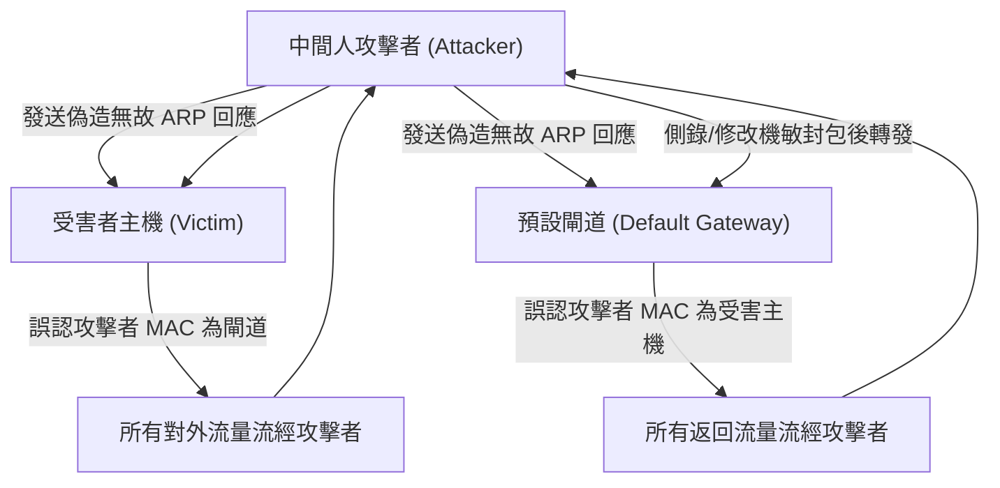

# 🛡️ SECPLUS-13-26-32 CompTIA Security+ Lesson 13 頁26~32：網路層中間人攻擊（MitM）、ARP 欺騙毒化與 Rogue DHCP 防禦

> **課程主題**：局域網中間人攻擊（MitM）、ARP 快取毒化與交換器二層防護實務  
> **授課講師**：授課講師（資安與網路認證原廠認證講師）  
> **核心模組**：CompTIA Security+ Topic 13: Layer 2 Network Attacks & MitM  
> **學習目標**：剖析 ARP Spoofing 劫持流量機制、配置 DHCP Snooping 與 DAI 交換器防護  
> **關聯文件**：[📄 完整原話逐字稿 (SecurityPlus-Lesson13-26-32-網路中間人攻擊與ARP毒化防禦-proofread.md)](./SecurityPlus-Lesson13-26-32-網路中間人攻擊與ARP毒化防禦-proofread.md)

---

## 🏛️ 核心架構與概念流轉圖

---

## 🔑 重點提要 (Key Takeaways)

1. **ARP 協定先天無驗證**：ARP 設計上信任所有接收到的 ARP Reply，導致局域網任何一台電腦都能聲稱自己是 Gateway。
2. **DHCP Snooping + DAI 鐵三角**：交換器啟用 DHCP Snooping 建立 IP-MAC-Port 綁定表，動態 ARP 檢驗（DAI）即以此表為基準丟棄非法 ARP 封包。
