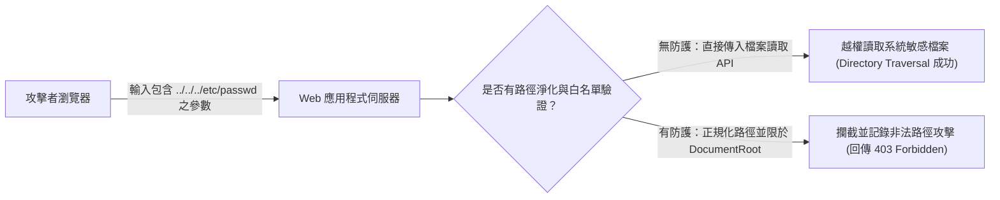

# 🛡️ SECPLUS-14-01-09 CompTIA Security+ Lesson 14 頁01~09：Web 應用程式攻擊面、目錄遍歷（Directory Traversal）與注入防禦

> **課程主題**：Web 應用程式安全、目錄遍歷（Directory Traversal）與注入攻擊防護  
> **授課講師**：授課講師（資安與網路認證原廠認證講師）  
> **核心模組**：CompTIA Security+ Topic 14: Web Application Vulnerabilities  
> **學習目標**：理解目錄周遊路徑解析漏洞、掌握 WAF 過濾與嚴格白名單輸入驗證  
> **關聯文件**：[📄 完整原話逐字稿 (SecurityPlus-Lesson14-01-09-Web應用程式漏洞與目錄周遊防禦-proofread.md)](./SecurityPlus-Lesson14-01-09-Web應用程式漏洞與目錄周遊防禦-proofread.md)

---

## 🏛️ 核心架構與概念流轉圖

---

## 🔑 重點提要 (Key Takeaways)

1. **目錄遍歷本質**：利用作業系統之相對路徑符號（`../`）逃逸出 Web Server 的根目錄限制，存取未經授權之主機系統設定檔。
2. **根本防禦思維**：絕不可將使用者傳入的字串直接拼接為作業系統指令或檔案路徑，必須進行 Canonicalization（路徑規範化）與白名單限制。
