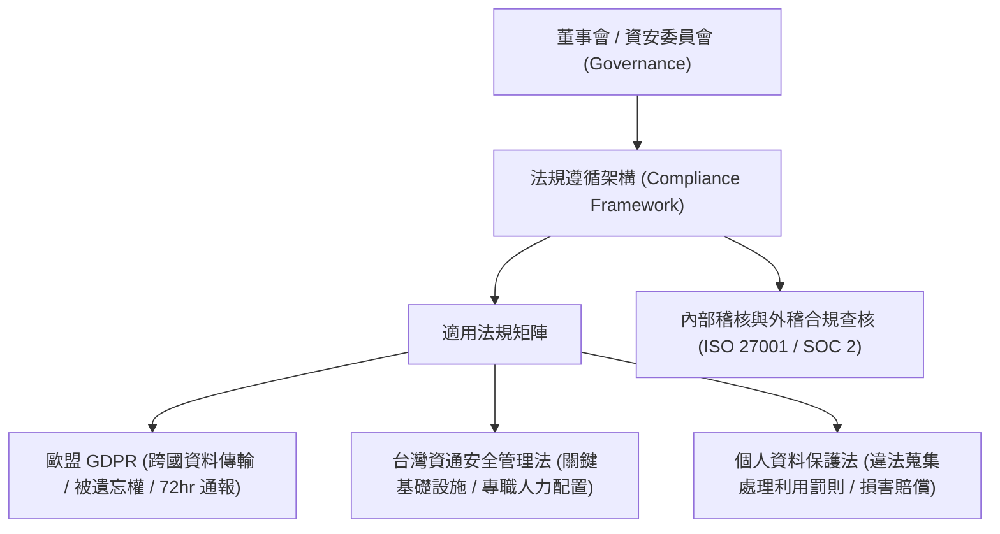

# 🛡️ SECPLUS-14-10-25 CompTIA Security+ Lesson 14 頁10~25：法規遵循框架、GDPR、台灣資通安全管理法與個資法

> **課程主題**：資安合規框架、歐盟 GDPR 隱私規範與台灣資安法制實務  
> **授課講師**：授課講師（資安與網路認證原廠認證講師）  
> **核心模組**：CompTIA Security+ Topic 14: Compliance, Governance & Privacy Laws  
> **學習目標**：理解資通安全管理法 A~E 分級責任、個資法侵害民刑事風險與內部稽核  
> **關聯文件**：[📄 完整原話逐字稿 (SecurityPlus-Lesson14-10-25-法規遵循框架與台灣資安法個資法實務-proofread.md)](./SecurityPlus-Lesson14-10-25-法規遵循框架與台灣資安法個資法實務-proofread.md)

---

## 🏛️ 核心架構與概念流轉圖

---

## 🔑 重點提要 (Key Takeaways)

1. **資安法責任分級**：公務機關與特定非公務機關（關鍵基礎設施）依 A、B、C、D、E 級承擔不同等級的資安人員配置、通報時限與演練責任。
2. **GDPR 巨額罰款**：最高可達全球營業額 4% 或 2000 萬歐元，倒逼全球企業全面重構資料隱私保護架構。
