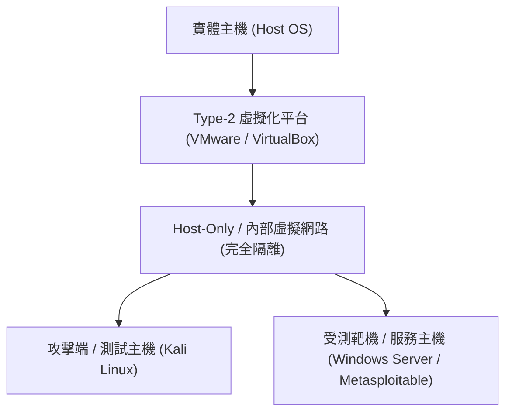

# 🛡️ SEC-15 CompTIA Security+ Lesson 15：資安實驗環境安裝配置與實機實作排程

> **課程主題**：安全隔離之資安實務攻防實驗室架構建置  
> **授課講師**：授課講師（資安與網路認證原廠認證講師）  
> **核心模組**：CompTIA Security+ Practical Lab Deployment  
> **學習目標**：掌握安全隔離沙箱環境規劃、虛擬機快照管理與實作安全防護  
> **關聯文件**：[📄 完整原話逐字稿 (SecurityPlus-Lesson15-實作環境安裝與演練-proofread.md)](./SecurityPlus-Lesson15-實作環境安裝與演練-proofread.md)

---

## 🏛️ 核心架構與概念流轉圖

---

## 🔬 技術精華與核心考點解析

### 資安實驗室隔離規範

- 演練攻防與惡意程式分析時，虛擬機網卡必須設為 Host-Only 或獨立內部虛擬網路，嚴禁橋接（Bridged）至真實校園或公司區網。
- 實驗前務必建立乾淨快照（Snapshot），實驗完畢一鍵還原，杜絕環境被污染。

---

## 💡 關鍵總結與考試應對重點

1. **進行安全測試前，永遠確認授權範圍（Scope of Work / Rules of Engagement），未獲授權的掃描即屬違法。**
