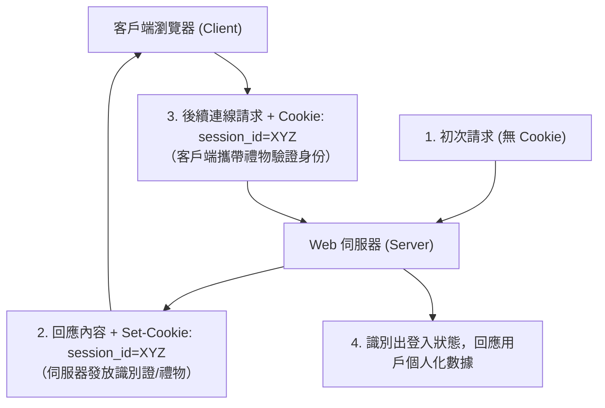
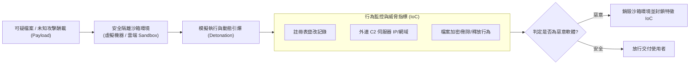

# 🛡️ SECPLUS-SPRINT-NETSERVICES-SANDBOX CompTIA Security+ 考前衝刺：網路服務安全、DNS 防護、Cookie 機制與雲端沙箱分析

> **課程主題**：CompTIA Security+ 核心考點衝刺、網路服務弱點掃描、DNS 安全防護、HTTP Cookie 狀態維護與惡意軟體沙箱動態分析  
> **授課教授**：授課講師（資安認證原廠講師）  
> **核心模組**：Network Services Security, DNSSEC, HTTP Stateless, Session Cookies, Dynamic Sandbox Analysis  
> **學習目標**：掌握網路服務通訊安全之核心考題解題要領，深入理解 Cookie 維持無狀態連線機制與沙箱隔離引爆惡意程式之原則  
> **關聯文件**：[📄 完整原話逐字稿 (SecurityPlus-重點衝刺-網路服務安全DNS與雲端沙箱分析-proofread.md)](./SecurityPlus-重點衝刺-網路服務安全DNS與雲端沙箱分析-proofread.md)

---

## 🏛️ HTTP 無狀態性 (Stateless) 與 Cookie 會話維護

---

## 🔬 惡意程式沙箱 (Sandbox) 動態引爆分析流程

---

## 🎯 核心重點整理 (Key Takeaways)

### 1. 網路服務掃描與 DNS 安全 (DNSSEC)
- **場景題型解法**：Security+ 考試中，遇到網路服務掃描（Network Service Scanning）場景題，重點在於辨識特定通訊埠（如 Port 53 DNS、Port 80/443 HTTP/S）對應的協定漏洞。
- **DNS 安全威脅與 DNSSEC**：傳統 DNS 查詢採明文 UDP，極易遭受快取污染（DNS Cache Poisoning）與中間人偽造。DNSSEC 利用密碼學數位簽章確保回應記錄之真實性與完整性。

### 2. Cookie 與會話安全防護
- **HTTP 的無狀態本質**：TCP 連線中斷後，伺服器不保存客戶端記憶。Cookie 如同客戶端攜帶的通行憑證。
- **安全旗標設定**：
  - **`HttpOnly`**：防止 XSS 跨站腳本攻擊透過 JavaScript 竊取 Cookie。
  - **`Secure`**：強制僅能透過 HTTPS 加密通道傳輸。
  - **`SameSite`**：防範 CSRF 跨站請求偽造。

### 3. 沙箱 (Sandbox) 動態分析原則
- **隔離引爆（Safe Detonation）**：針對疑似帶有惡意巨集或零日漏洞（Zero-day）的檔案，在完全隔離的虛擬作業系統中放行執行，觀察其對檔案系統、行程創建與網路外聯的動態行為。
- **快照還原與雲端部署**：分析完畢後自動重設或炸毀虛擬容器，確保生產環境不受任何污染。
