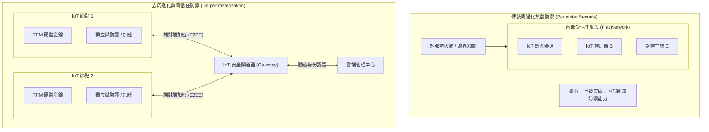
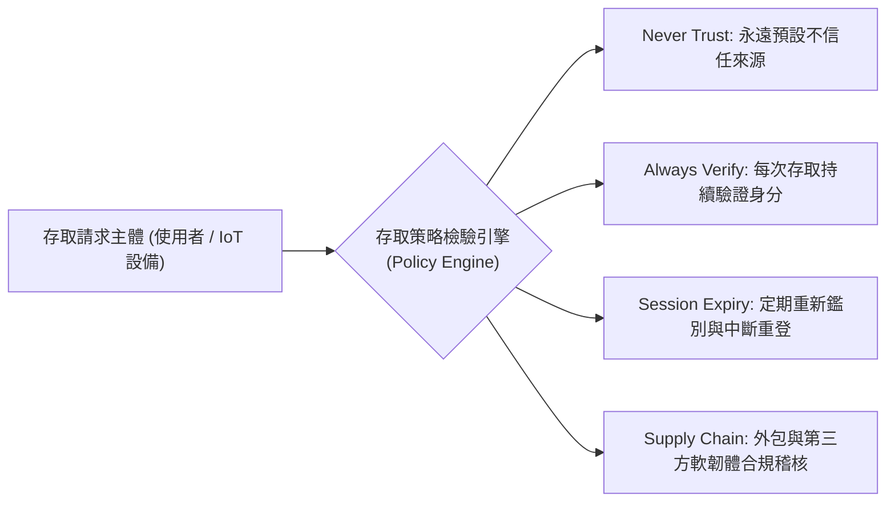

# 🛡️ IOT-SEC-01-DEPERIMETER-ZEROTRUST-TPM 物聯網資安實務 Lesson 01：去周邊化集體防禦、零信任持續身分驗證與 TPM 硬體信任根

> **課程主題**：去周邊化（De-perimeterization）、零信任安全模型（Zero Trust）、可信賴平台模組（TPM）硬體信任根與 IoT Gateway 邊緣防禦  
> **授課教授**：授課講師（資安與物聯網專題講座教授）  
> **核心模組**：IoT Security, De-perimeterization, Zero Trust Architecture, Continuous Authentication, TPM Root of Trust, Gateway Security  
> **學習目標**：理解傳統邊界防火牆集體防禦之局限性，掌握物聯網去周邊化之各端點微防護理念，並熟悉零信任持續驗證與 TPM 加解密防護技術  
> **關聯文件**：[📄 完整原話逐字稿 (2024-11-15-01-去周邊化防禦與零信任TPM-proofread.md)](./2024-11-15-01-去周邊化防禦與零信任TPM-proofread.md)

---

## 🏛️ 傳統周邊防禦 vs. 去周邊化 (De-perimeterization) 架構對比

---

## 📊 零信任架構 (Zero Trust) 核心運作原則

---

## 🎯 核心重點整理 (Key Takeaways)

### 1. 去周邊化 (De-perimeterization) 演進與物聯網威脅
- **傳統集中式周邊防禦的破綻**：過去將大量無防護之 IoT 感測裝置置於防火牆後方之同一網段，採集體防禦策略。然而一旦單一節點遭實體接觸入侵或外包程式碼污染，攻擊者便可於內網橫向移動（Lateral Movement）。
- **去周邊化核心觀念**：打破傳統邊界內外之假定信任，將每個物聯網邊緣裝置均視為可能暴露於公網之獨立受防護實體，直接在端點設備實施安全防護與通訊加密。

### 2. 零信任架構落地原則：Never Trust, Always Verify
- **持續性身分驗證**：零信任的核心絕非拒絕存取，而是對每一次操作、每一個 API 調用進行動態且持續的身分鑑別。
- **連線工作階段限制**：針對企業無線網路（Wi-Fi）或遠端連線，實施強制存取時間門檻（例如連線一小時後自動踢除並強制重驗），杜絕長效憑證竊取風險。
- **供應鏈與外包安全**：嚴格落實外包軟硬體產品（Outsourcing）交付時的程式碼審查與完整性校驗，避免引發數十億級別之重大資安事故。

### 3. TPM 硬體信任根與邊緣防護
- **可信賴平台模組（TPM）**：物聯網端點可採用標準化硬體晶片（TPM 2.0），將加解密金鑰、數位憑證與雜湊測量值封存在防篡改硬體內，建立不可篡改的信任根（Root of Trust）。
- **IoT Gateway 與端對端加密**：小型微感測器因算力限制難以執行高階演算法時，透過安全 IoT 通訊閘道器進行封包聚合、協定轉換與加密通道傳輸，達成雲地一體安全合規。
