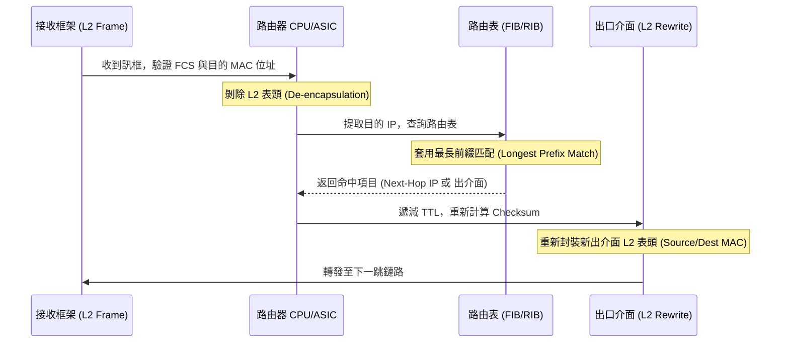

# 🛡️ CCNA-303-304 Cisco CCNA 1 Lesson 頁303~304：封包轉發決策流程與路由表長度匹配規則

> **課程主題**：路由器第二層/第三層解封裝機制與最長前綴匹配（Longest Prefix Match）轉發決策  
> **授課講師**：授課講師（資安與網路認證原廠認證講師）  
> **核心模組**：Cisco CCNA 1 Chapter 8: Packet Forwarding Decision  
> **學習目標**：掌握 MAC 位址解封裝、目的 IP 查詢、Longest Match 優先權及重封裝流程  
> **關聯文件**：[📄 完整原話逐字稿 (2025-01-06-Lesson-303-304-封包轉發決策流程與路由表長度匹配規則-proofread.md)](./2025-01-06-Lesson-303-304-封包轉發決策流程與路由表長度匹配規則-proofread.md)

---

## 🏛️ 核心架構與概念流轉圖

---

## 🔬 技術精華與核心考點解析

### 1. 路由器轉發決策三步驟
1. **解封裝驗證**：檢查訊框目的 MAC 是否為本路由器介面，若是則剝除 L2 Header。
2. **查表匹配**：依據封包目的 IP 在路由表中進行比對。
3. **重新封裝**：查詢 ARP 快取取得下一跳之 MAC 位址，將 TTL 減 1，封裝全新 L2 表頭後由指定出介面送出。

### 2. 最長前綴匹配（Longest Prefix Match）
- 當路由表存在多筆皆可涵蓋目的 IP 的網段時，**遮罩最長（Prefix 長度最大）者勝出**。
- 例：目的位址 `172.16.0.10`，若同時匹配 `172.16.0.0/16` 與 `172.16.0.0/24`，路由器優先採用 `/24` 路由。

---

## 💡 關鍵總結與考試應對重點

1. **考試必考：封包跨越路由器轉發時，IP 表頭的 Source IP 與 Destination IP 保持不變，但第二層 MAC 位址在每一跳皆會被重寫更換！**
2. **核心觀念：路由表匹配順序為「先比最長前綴匹配（Prefix Length），前綴長度相同才比管理距離（AD），AD 相同才比度量值（Metric）」。**
