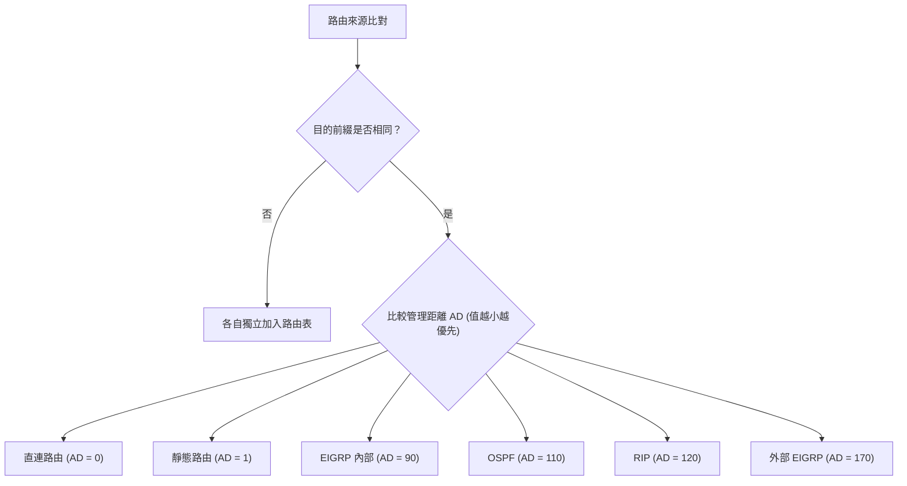

# 🛡️ CCNA-304-308 Cisco CCNA 1 Lesson 頁304~308：管理距離 AD 值判斷與靜態路由配置語法

> **課程主題**：管理距離 AD 評定順序、Metric 權重與 Cisco IOS `ip route` 配置實務  
> **授課講師**：授課講師（資安與網路認證原廠認證講師）  
> **核心模組**：Cisco CCNA 1 Chapter 8: Static Route Configuration & AD  
> **學習目標**：熟記各協定 AD 值、區分下一跳 IP 與出介面配置差異及避免遞迴查表效能耗損  
> **關聯文件**：[📄 完整原話逐字稿 (2025-01-06-Lesson-304-308-管理距離AD值判斷與靜態路由配置語法-proofread.md)](./2025-01-06-Lesson-304-308-管理距離AD值判斷與靜態路由配置語法-proofread.md)

---

## 🏛️ 核心架構與概念流轉圖

---

## 🔬 技術精華與核心考點解析

### 1. 管理距離（AD）標準表
| 路由類型 / 協定 | 管理距離 (AD) | 說明 |
| :--- | :--- | :--- |
| **Connected (直連)** | 0 | 介面啟用且配置 IP |
| **Static (靜態)** | 1 | 管理者手動指派 |
| **EIGRP Summary** | 5 | 彙總路由 |
| **eBGP** | 20 | 外部 BGP |
| **EIGRP (內部)** | 90 | 企業內部專用 |
| **OSPF** | 110 | 開放式最短路徑優先 |
| **IS-IS** | 115 | 中間系統協定 |
| **RIP** | 120 | 距離向量 |
| **Unreachable** | 255 | 永不放入路由表 |

### 2. 靜態路由三種配置型態
1. **Next-Hop Static Route**：`ip route <network> <mask> <next-hop-ip>`
   - 需進行**遞迴查表（Recursive Lookup）**：先查目標網段下一跳，再查下一跳所在之出介面。
2. **Directly Attached Static Route**：`ip route <network> <mask> <exit-intf>`
   - 僅適用於 Point-to-Point（點對點）序列鏈路。若用在 Ethernet 廣播網路會造成大量 ARP 請求。
3. **Fully Specified Static Route**：`ip route <network> <mask> <exit-intf> <next-hop-ip>`
   - 兼具出介面與下一跳 IP，無需遞迴查詢且支援多重存取網路。

---

## 💡 關鍵總結與考試應對重點

1. **考試常考：若同一目的網段透過 OSPF (AD=110) 與 RIP (AD=120) 同時學到，路由器必定只將 OSPF 路由寫入路由表！**
2. **配置口訣：`ip route [目的網段] [子網遮罩] [下一跳IP或出口介面]`。**
