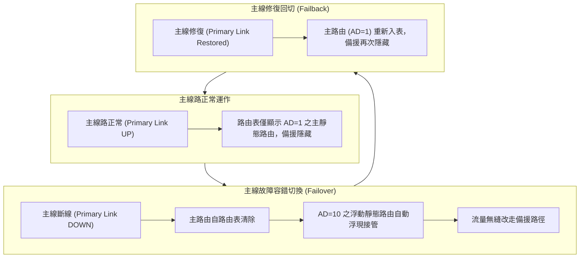

# 🛡️ CCNA-320-329 Cisco CCNA 1 Lesson 頁320~329：浮動靜態路由容錯切換實測與動態路由引入

> **課程主題**：浮動靜態路由（Floating Static Route）設定、主備線路容錯切換與動態路由引言  
> **授課講師**：授課講師（資安與網路認證原廠認證講師）  
> **核心模組**：Cisco CCNA 1 Chapter 8: Floating Static Routes & Failover  
> **學習目標**：透過調高 AD 值實現備援路徑、實機驗證主線斷開後備援路由浮現及恢復回切機制  
> **關聯文件**：[📄 完整原話逐字稿 (2025-01-06-Lesson-320-329-浮動靜態路由容錯切換與動態路由引入-proofread.md)](./2025-01-06-Lesson-320-329-浮動靜態路由容錯切換與動態路由引入-proofread.md)

---

## 🏛️ 核心架構與概念流轉圖



---

## 🔬 技術精華與核心考點解析

### 1. 浮動靜態路由配置語法
```cisco
! 主路由 (預設 AD = 1)
ip route 10.3.1.0 255.255.255.0 10.0.0.6

! 浮動備援路由 (手動指定 AD = 10，高於主路由)
ip route 10.3.1.0 255.255.255.0 10.0.0.2 10
```
- **平時狀態**：因主路由 AD=1 較小，備援路由隱藏於後台，不入路由表。
- **故障狀態**：主介面 Down 掉時，主路由立即失效移出，浮動路由（AD=10）自動浮現寫入路由表接管流量。

---

## 💡 關鍵總結與考試應對重點

1. **考試常考：浮動靜態路由的管理距離（AD）必須高於主要路徑的 AD 值（若主路徑為靜態則 AD 設為 2~254，若主路徑為 OSPF 則設大於 110）。**
2. **切換特性：浮動靜態路由只能在直連介面感知實體 Link Down 時瞬間切換；若斷點發生在跨跳遠端，則需搭配 IP SLA 與 Track 追蹤機制。**
