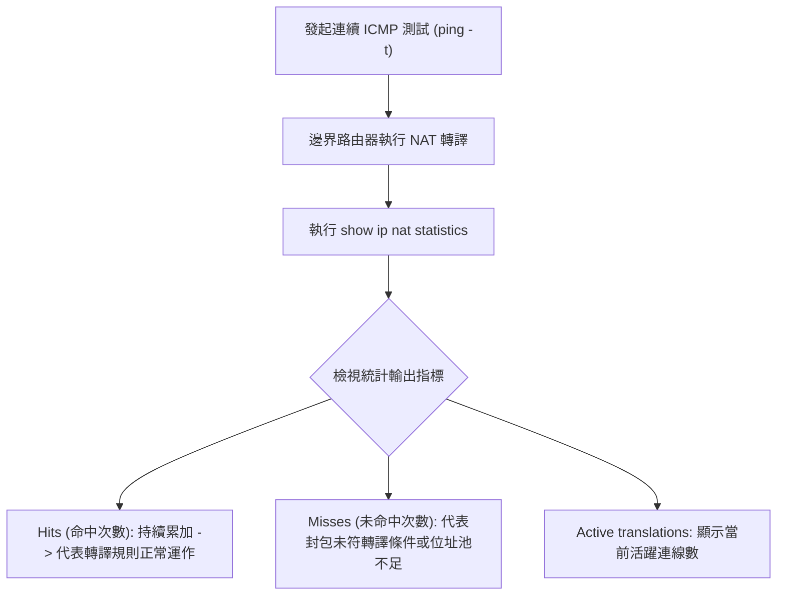

# 🛡️ CCNA-Lab-NAT01 Cisco CCNA 1 Lab NAT01：NAT轉換統計監控與InsideOutside介面驗證

> **課程主題**：NAT 運作統計驗證、Hits/Misses 計數器判讀與 Inside/Outside 介面狀態診斷  
> **授課講師**：授課講師（資安與網路認證原廠認證講師）  
> **核心模組**：Cisco CCNA 1 Lab NAT01: Verifying NAT Statistics  
> **學習目標**：掌握 `show ip nat statistics` 輸出、辨識活躍轉換條目及透過連續 ping 驗證 Hits 增加  
> **關聯文件**：[📄 完整原話逐字稿 (2025-01-08-Lab-NAT01-NAT轉換統計監控與InsideOutside介面驗證-proofread.md)](./2025-01-08-Lab-NAT01-NAT轉換統計監控與InsideOutside介面驗證-proofread.md)

---

## 🏛️ 核心架構與概念流轉圖

---

## 🔬 技術精華與核心考點解析

### 1. `show ip nat statistics` 關鍵欄位解析
- **Total active translations**：當前記憶體中存在的有效 NAT 轉譯總數。
- **Outside interfaces / Inside interfaces**：明確列出已套用 `ip nat outside` 與 `ip nat inside` 的實體與邏輯介面清單。
- **Hits**：封包成功命中轉譯規則並完成 IP/Port 轉換的封包數量。
- **Misses**：嘗試進行轉譯但找不到現成條目（需動態新建）或轉譯失敗的次數。

---

## 💡 關鍵總結與考試應對重點

1. **實務排錯：若連線不通且 Hits 次數為 0，代表流量在到達 NAT 模組前已被 ACL 阻擋，或根本未送達該路由介面！**
2. **清除指令：測試重置時使用 `clear ip nat translation *` 可強制清空所有動態轉譯快取。**
