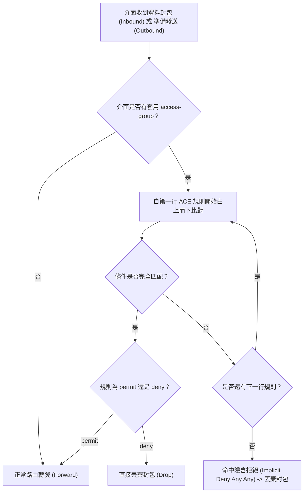

# 🛡️ CCNA-383-388 Cisco CCNA 1 Lesson 頁383~388：存取控制清單ACL原理與萬用遮罩計算法則

> **課程主題**：Cisco ACL 封包過濾機制、Wildcard Mask 反向遮罩二進位計算與清單編號分類  
> **授課講師**：授課講師（資安與網路認證原廠認證講師）  
> **核心模組**：Cisco CCNA 1 Chapter 10: ACL Principles & Wildcard Mask  
> **學習目標**：掌握 ACL 規則匹配流轉、精確計算萬用遮罩（255.255.255.255 減去子網遮罩）及應用場景  
> **關聯文件**：[📄 完整原話逐字稿 (2025-01-08-Lesson-383-388-存取控制清單ACL原理與萬用遮罩計算法則-proofread.md)](./2025-01-08-Lesson-383-388-存取控制清單ACL原理與萬用遮罩計算法則-proofread.md)

---

## 🏛️ 核心架構與概念流轉圖

---

## 🔬 技術精華與核心考點解析

### 1. 萬用字元遮罩（Wildcard Mask）計算技巧
- **反向相減法則**：`255.255.255.255` 減去「子網路遮罩」即為對應之萬用遮罩。
  - `/24 (255.255.255.0)` -> 萬用遮罩 `0.0.0.255`。
  - `/27 (255.255.255.224)` -> 萬用遮罩 `0.0.0.31`。
  - `/30 (255.255.255.252)` -> 萬用遮罩 `0.0.0.3`。
- **特殊縮寫關鍵字**：
  - `host 192.168.1.1` 等同於 `192.168.1.1 0.0.0.0`（嚴格精確比對單一主機）。
  - `any` 等同於 `0.0.0.0 255.255.255.255`（忽略全部位元，比對所有位址）。

### 2. ACL 編號範圍與功能
| 清單類型 | 傳統標準編號 | 擴充編號範圍 | 檢查條件 |
| :--- | :--- | :--- | :--- |
| **標準 ACL (Standard)** | 1 ~ 99 | 1300 ~ 1999 | **僅檢查來源 IP 位址** |
| **延伸 ACL (Extended)** | 100 ~ 199 | 2000 ~ 2699 | 檢查來源/目的 IP、協定 (TCP/UDP/ICMP) 及連接埠號 |

---

## 💡 關鍵總結與考試應對重點

1. **考試鐵則：所有 ACL 清單的最末尾，皆存在一行看不見的「隱含拒絕（Implicit Deny Any Any）」，若未命中任何 permit 規則，封包一律遭丟棄！**
2. **規則順序：ACL 採由上而下（Top-Down）初次匹配即停止，範圍最小、條件最嚴苛的規則必須寫在前面！**
