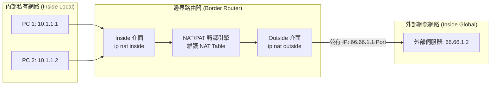

# 🛡️ CCNA-SPRINT-NAT-PAT Cisco CCNA 1 認證衝刺：靜態 NAT、動態 NAT 與 PAT 連接埠位址轉換配置實務


> **課程主題**：網路位址轉換（NAT）、連接埠位址轉換（PAT）、靜態 vs. 動態 NAT、邊界路由器介面宣告與 NAT Table 檢查  
> **授課教授**：授課講師（Cisco 認證原廠講師）  
> **核心模組**：Static NAT, Dynamic NAT, PAT (NAT Overload), ip nat inside/outside, show ip nat translations  
> **學習目標**：精熟 Cisco 路由器之 NAT 核心指令與運作原理，正確配置 Inside/Outside 介面並透過流量觸發驗證轉譯表  
> **關聯文件**：[📄 完整原話逐字稿 (2025-01-08-認證衝刺-靜態動態NAT與PAT位址轉換實務配置-proofread.md)](./2025-01-08-認證衝刺-靜態動態NAT與PAT位址轉換實務配置-proofread.md)

---

## 🏛️ NAT / PAT 運作模型與位址映射拓撲



---

## 📋 三種 NAT 轉換模式對照表

| NAT 類型 | 轉換對應關係 | 公有 IP 需求 | 典型應用場景 |
| :--- | :--- | :--- | :--- |
| **靜態 NAT (Static NAT)** | 1 對 1 固定映射 | 1 個私網對應 1 個公網 | 內部 Web/Mail 伺服器對外公開服務 |
| **動態 NAT (Dynamic NAT)** | 1 對 1 動態共享池 | 依池內公有 IP 數量決定並發數 | 內部主機有限度訪問外網 |
| **PAT (NAT Overload)** | 多對 1 (以連接埠區分) | 單一或極少數公有 IP 支援數萬連線 | 企業與家庭最普遍之連網模式 |

---

## 🎯 核心重點整理 (Key Takeaways)

### 1. 介面角色宣告 (Interface Configuration)
- **`ip nat inside`**：定義私有網路入口介面（如 Ethernet 0/0）。
- **`ip nat outside`**：定義連接網際網路之公網介面（如 Serial 0/0/0 或 Ethernet 0/1）。
- **注意**：介面宣告錯誤將導致轉譯引擎無法識別流量流向，造成封包直接被丟棄。

### 2. 驗證與障礙排除
- **動態條目生成**：動態 NAT 與 PAT 僅在內部主機主動發起外向流量（如 Ping 或 HTTP 請求）時，才會在轉譯表中建立動態映射紀錄。
- **檢查指令**：
  ```bash
  Router# show ip nat translations
  Router# show ip nat statistics
  Router# clear ip nat translation *
  ```
