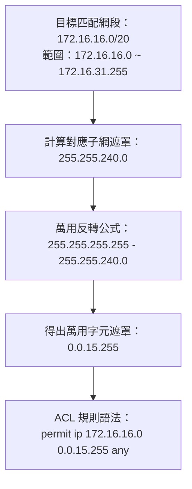

# 🛡️ CCNA-FAST-08A Cisco CCNA 1 Fastlab 08 Part 1：萬用字元遮罩（Wildcard Mask）心算推導與 ACL 範圍匹配

> **課程主題**：萬用字元遮罩（Wildcard Mask）二進位本質與跨網段極速心算  
> **授課講師**：授課講師（資安與網路認證原廠認證講師）  
> **核心模組**：Cisco CCNA 1 Fastlab: Wildcard Mask Calculations  
> **學習目標**：掌握 0 比對 / 1 忽略二進位規則、255 相減反轉法及多子網聚合匹配  
> **關聯文件**：[📄 完整原話逐字稿 (2025-01-09-Lab-Fastlab08A-萬用字元遮罩計算-proofread.md)](./2025-01-09-Lab-Fastlab08A-萬用字元遮罩計算-proofread.md)

---

## 🏛️ 核心架構與概念流轉圖

---

## 🔬 技術精華與核心考點解析

### Wildcard Mask 二進位本質

- 0 位元：代表該位元『必須完全相符（Must Match）』。
- 1 位元：代表該位元『忽略不比對（Don't Care / Ignore）』，可為 0 或 1。

### 極速心算法則

- 連續子網情況下，Wildcard Mask = `255.255.255.255` - `Subnet Mask`。
- 範例：要比對 /28 網段（遮罩 255.255.255.240），Wildcard 即為 `0.0.0.15`。
- 範例：要匹配 172.16.16.0 ~ 172.16.31.255（區間跨度 16 個 Class C），第三個八位元遮罩為 256-16=240，Wildcard 第三段即為 255-240 = 15，總遮罩為 `0.0.15.255`。

---

## 💡 關鍵總結與考試應對重點

1. **考試常考：`host 192.168.1.1` 等同於 `192.168.1.1 0.0.0.0`；`any` 等同於 `0.0.0.0 255.255.255.255`。**
1. **萬用字元遮罩與子網遮罩的二進位完全相反，切勿混淆。**
