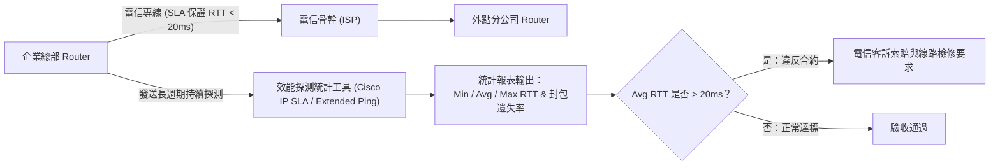

# 🛡️ CCNA-FAST-08B Cisco CCNA 1 Fastlab 08 Part 2：網路效能監控、RTT 延遲統計與電信專線 SLA 實務驗證

> **課程主題**：企業專線網路服務水準協議（SLA）量測與 RTT 延遲統計實戰  
> **授課講師**：授課講師（資安與網路認證原廠認證講師）  
> **核心模組**：Cisco CCNA 1 Fastlab: Performance Monitoring & SLA Verification  
> **學習目標**：掌握 Cisco 效能統計命令、RTT 三大延遲指標解讀及電信合約 SLA 檢驗標準  
> **關聯文件**：[📄 完整原話逐字稿 (2025-01-09-Lab-Fastlab08B-網路延遲統計與SLA分析-proofread.md)](./2025-01-09-Lab-Fastlab08B-網路延遲統計與SLA分析-proofread.md)

---

## 🏛️ 核心架構與概念流轉圖

---

## 🔬 技術精華與核心考點解析

### RTT 三大關鍵統計數據解讀

- Min RTT：網路完全暢通時的物理傳輸下限。
- Avg RTT：日常運作的核心評估基準，SLA 合約承諾標準主要檢視此數值。
- Max RTT：代表網路發生瞬時壅塞、佇列堆疊（Queueing Delay）或路由抖動的峰值極限。

### 電信 SLA 驗收實務戰術

- 企業向電信業者租用專線（如 MPLS VPN、光纖專線）時，合約皆附帶 SLA 保證（如延遲低於 15ms、可用率 99.9%）。
- 網工在日常維運與驗收時，必須善用連續長期探測統計，產出量化數據報表，作為要求電信商改善路由或進行合約扣款索賠的確鑿憑據。

---

## 💡 關鍵總結與考試應對重點

1. **Cisco CLI 中使用 `ping` 進階模式可設定封包大小（Data size）與發送次數（Repeat count），例如發送 1000 個 1500-byte 封包嚴苛壓力測試。**
1. **Jitter（抖動）為連續封包延遲變異量，在 VoIP 與視訊會議等即時串流環境中是比單純延遲更致命的故障指標。**
