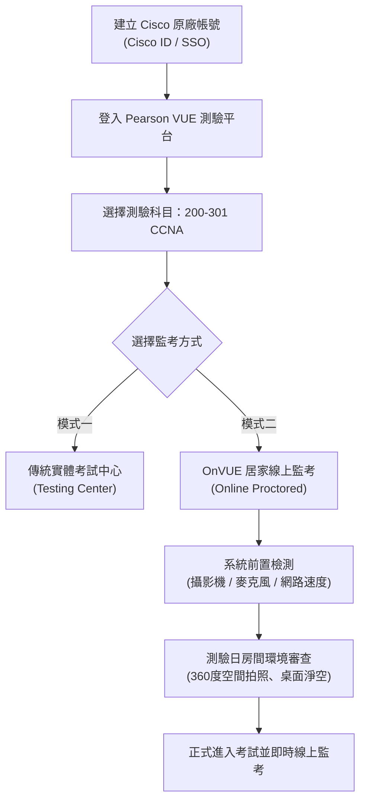

# 🛡️ CCNA-00 Cisco CCNA 1 認證報考流程、Pearson VUE 帳號註冊與 OnVUE 居家線上考試指南

> **課程主題**：Cisco CCNA 國際認證報考流程全攻略與 Pearson VUE 系統操作  
> **授課講師**：授課講師（資安與網路認證原廠認證講師）  
> **核心模組**：Cisco 認證管理系統與 Pearson VUE 線上考試服務  
> **學習目標**：熟悉原廠帳號綁定、考期排定、測驗費用支付及 OnVUE 線上居家監考設備合規標準  
> **關聯文件**：[📄 完整原話逐字稿 (2025-01-10-00-認證報考與OnVUE考試規則-proofread.md)](./2025-01-10-00-認證報考與OnVUE考試規則-proofread.md)

---

## 🏛️ 核心架構與概念流轉圖

---

## 🔬 技術精華與核心考點解析

### Pearson VUE 平台與原廠授權機制

- 各大 IT 原廠（Cisco、CompTIA、Microsoft、AWS 等）測驗皆全面由 Pearson VUE 承辦提供測驗環境。
- 考題與題庫由各原廠端出題並加密推送，Pearson VUE 提供認證身分核驗與安全防弊防護。

### Cisco 原廠帳號與 SSO 整合

- 必須使用個人長久使用的 Email 建立 Cisco Account，以利後續長期證照延展與證書下載。
- 支援 Single Sign-On (SSO) 單一登入，考取證書後可於個人 Dashboard 獲取數位徽章（Digital Badge）與 PDF 證書。

### OnVUE 線上居家監考合規指南

- 硬體要求：電腦必須配備高品質視訊鏡頭（Webcam）與穩定麥克風，禁止使用外接雙螢幕。
- 環境規範：必須在四面有牆的獨立封閉小房間，測驗過程中嚴禁他人進入或出聲。
- 考前檢查：考官將要求透過鏡頭 360 度環視房間、桌面全面淨空（無紙筆、水杯無標籤、手機放遠處）。

---

## 💡 關鍵總結與考試應對重點

1. **OnVUE 考試前一天務必提前完成系統系統相容性測試（System Test），避免當天因防火牆擋截視訊串流。**
1. **考試過程中目光嚴禁長時間偏離螢幕，否則線上考官（Proctor）有權立即中斷測驗並判定無效。**
1. **考完後現場螢幕即時顯示通過與否（Preliminary Score Report），正式證書於 24-48 小時內同步至 Cisco Tracking System。**
