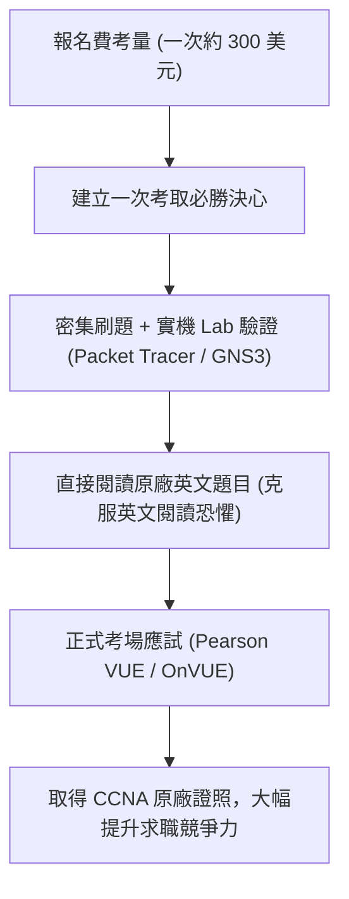

# 🛡️ CCNA1-EXAM-EXPERIENCE Cisco CCNA 1 認證備考心得：考照投資報酬率、英語能力優勢與三次應試歷史經驗談

> **課程主題**：Cisco CCNA 認證報考歷程、報名成本權衡、英語題意掌握與備考心態  
> **授課講師**：授課講師（資安與網路認證原廠認證講師）  
> **核心模組**：Cisco CCNA Exam Preparation & Strategy  
> **學習目標**：克服英語應試心理障礙、掌握原廠認證考核邏輯與備考排程  
> **關聯文件**：[📄 完整原話逐字稿 (2025-01-10-Review-認證報考心態與歷屆應試經驗談-proofread.md)](./2025-01-10-Review-認證報考心態與歷屆應試經驗談-proofread.md)

---

## 🏛️ 核心架構與概念流轉圖

---

## 🔑 重點提要 (Key Takeaways)

1. **英語原廠題目優勢**：CCNA 專業術語直接閱讀英文原題最為精確，中文翻譯常有專用術語曲解，英語底子好的學員具備天然優勢。
2. **沉沒成本轉化動力**：考試費用昂貴（約一萬台幣），應將成本轉化為排定死線（Deadline）全力衝刺的決心。
