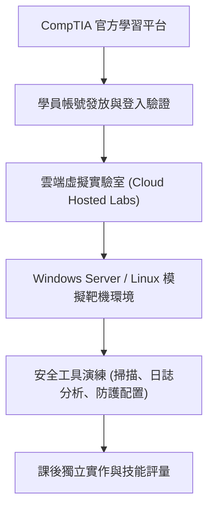

# 🛡️ SECPLUS-01-03-05 CompTIA Security+ Lesson 01 頁03~05：原廠線上實驗室開通、環境測試與操作實務

> **課程主題**：原廠雲端實驗室開通、帳號配置與實作環境架構  
> **授課講師**：授課講師（資安與網路認證原廠認證講師）  
> **核心模組**：CompTIA Security+ Topic 1: Hands-on Lab Environment Setup  
> **學習目標**：掌握原廠 Lab 系統登入流程、遠端虛擬主機連線與自學演練方式  
> **關聯文件**：[📄 完整原話逐字稿 (2025-01-13-Lesson01-03-05-原廠線上實驗室開通與實作-proofread.md)](./2025-01-13-Lesson01-03-05-原廠線上實驗室開通與實作-proofread.md)

---

## 🏛️ 核心架構與概念流轉圖

---

## 🔑 重點提要 (Key Takeaways)

1. **環境開通**：每位學員具備專屬虛擬實驗室存取金鑰，由瀏覽器直接存取後端雲端虛擬機器拓撲。
2. **實作考題關聯**：CompTIA 認證包含 Performance-Based Questions (PBQs)，必須熟悉實機操作介面。
