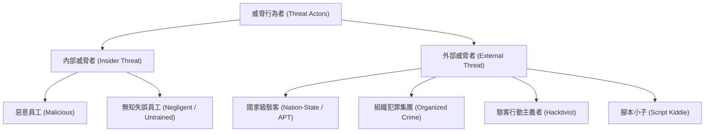

# 🛡️ SECPLUS-02-01-06 CompTIA Security+ Lesson 02 頁01~06：威脅行為者分類、攻擊動機與內外部威脅

> **課程主題**：威脅行為者（Threat Actors）類型屬性與背後動機分析  
> **授課講師**：授課講師（資安與網路認證原廠認證講師）  
> **核心模組**：CompTIA Security+ Topic 2: Threat Actors & Motivations  
> **學習目標**：掌握 APT 組織、內部威脅、腳本小子特徵與攻擊動機矩陣  
> **關聯文件**：[📄 完整原話逐字稿 (2025-01-13-Lesson02-01-06-威脅行為者分類與攻擊動機剖析-proofread.md)](./2025-01-13-Lesson02-01-06-威脅行為者分類與攻擊動機剖析-proofread.md)

---

## 🏛️ 核心架構與概念流轉圖

---

## 🔑 重點提要 (Key Takeaways)

1. **內部威脅危害最鉅**：威脅不限於頂尖駭客，內部未經訓練或疏忽大意的員工（豬隊友）常造成嚴重資安破口。
2. **資源與動機差異**：APT 組織具備國家級經費與長期潛伏能力；組織犯罪著重勒索金錢；腳本小子則缺乏底層理解僅依賴現成工具。
