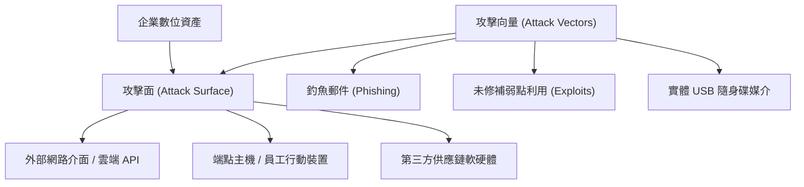

# 🛡️ SECPLUS-02-07-13 CompTIA Security+ Lesson 02 頁07~13：攻擊面分析、攻擊向量與威脅情資來源

> **課程主題**：攻擊面（Attack Surface）盤點、攻擊向量辨識與威脅情資收集  
> **授課講師**：授課講師（資安與網路認證原廠認證講師）  
> **核心模組**：CompTIA Security+ Topic 2: Attack Surfaces & Vectors  
> **學習目標**：理解系統漏洞與暴露途徑、掌握縮小攻擊面實務與威脅情報獲取管道  
> **關聯文件**：[📄 完整原話逐字稿 (2025-01-13-Lesson02-07-13-攻擊面與各類攻擊向量辨識-proofread.md)](./2025-01-13-Lesson02-07-13-攻擊面與各類攻擊向量辨識-proofread.md)

---

## 🏛️ 核心架構與概念流轉圖

---

## 🔑 重點提要 (Key Takeaways)

1. **攻擊面最小化**：關閉不需要的服務、連接埠與存取路徑，將潛在弱點暴露減至最低。
2. **向量防護重點**：電子郵件依然是最常見且最致命的攻擊向量，必須搭配嚴格的資安意識培訓與過濾機制。
