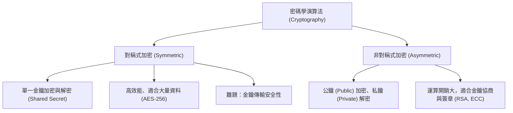

# 🛡️ SECPLUS-03-05-14 CompTIA Security+ Lesson 03 頁05~14：密碼學原理、對稱式加密與非對稱式加密架構

> **課程主題**：密碼學核心架構、對稱式加密與非對稱式金鑰交換實務  
> **授課講師**：授課講師（資安與網路認證原廠認證講師）  
> **核心模組**：CompTIA Security+ Topic 3: Cryptographic Algorithms  
> **學習目標**：理解對稱式（AES）與非對稱式（RSA/ECC）運作特性及金鑰交換挑戰  
> **關聯文件**：[📄 完整原話逐字稿 (2025-01-14-Lesson03-05-14-密碼學對稱式與非對稱式加密-proofread.md)](./2025-01-14-Lesson03-05-14-密碼學對稱式與非對稱式加密-proofread.md)

---

## 🏛️ 核心架構與概念流轉圖

---

## 🔑 重點提要 (Key Takeaways)

1. **混合加密架構**：實務上（如 TLS/HTTPS）結合非對稱式密碼學進行身分驗證與對稱金鑰交換，後續大量傳輸則使用高效之 AES 對稱式加密。
2. **金鑰管理核心**：演算法公開無妨，安全性全繫於私密金鑰之妥善保管。
