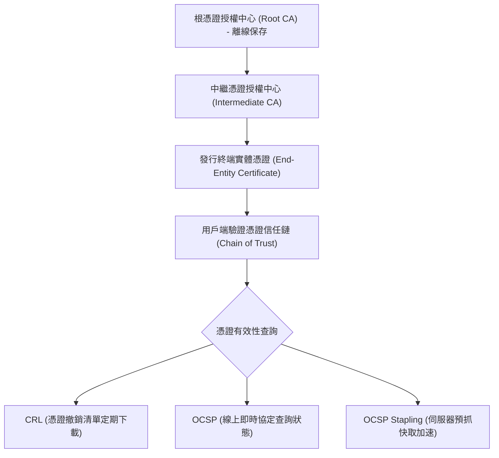

# 🛡️ SECPLUS-03-18-32 CompTIA Security+ Lesson 03 頁18~32：PKI 公鑰基礎設施、憑證撤銷清單與金鑰生命週期

> **課程主題**：PKI 公鑰基礎設施、CA 階層信任鏈與金鑰管理生命週期  
> **授課講師**：授課講師（資安與網路認證原廠認證講師）  
> **核心模組**：CompTIA Security+ Topic 3: Public Key Infrastructure (PKI)  
> **學習目標**：理解 X.509 憑證標準、CRL/OCSP 撤銷查詢與 HSM 硬體防護  
> **關聯文件**：[📄 完整原話逐字稿 (2025-01-14-Lesson03-18-32-PKI憑證撤銷清單與金鑰管理-proofread.md)](./2025-01-14-Lesson03-18-32-PKI憑證撤銷清單與金鑰管理-proofread.md)

---

## 🏛️ 核心架構與概念流轉圖

---

## 🔑 重點提要 (Key Takeaways)

1. **根 CA 離線原則**：Root CA 為整個信任體系之基石，簽發 Intermediate CA 後應立即離線實體封存，防止被駭。
2. **OCSP vs CRL**：CRL 存在更新延遲且檔案日益肥大；OCSP 提供即時查詢，而 OCSP Stapling 更解決了隱私與連線延遲問題。
