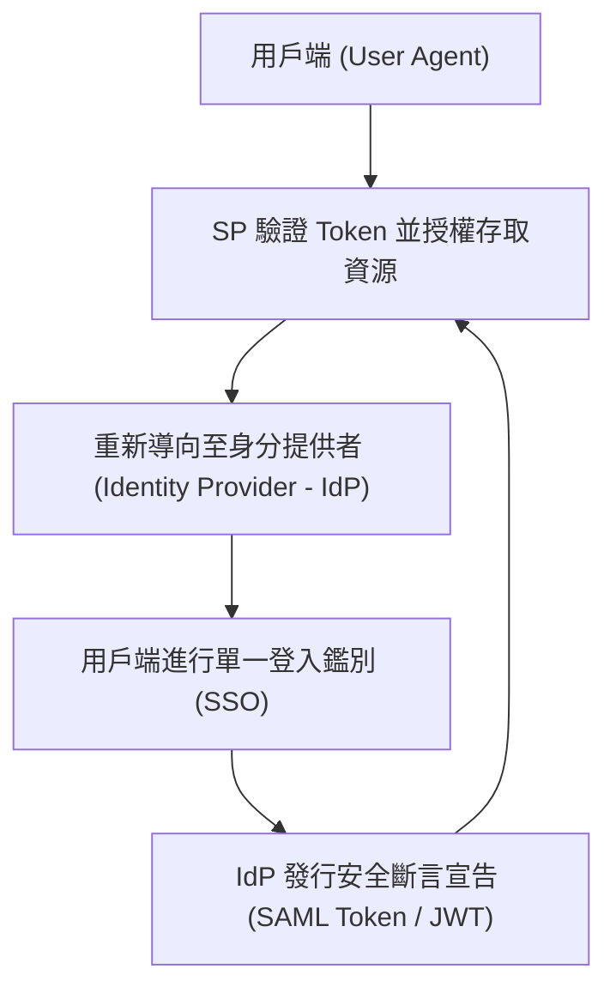

# 🛡️ SECPLUS-04-27-34 CompTIA Security+ Lesson 04 頁27~34：帳號生命週期管理、目錄服務與身分同盟（SSO）

> **課程主題**：集中式帳號管理、生命週期維運與同盟單一登入（SSO）  
> **授課講師**：授課講師（資安與網路認證原廠認證講師）  
> **核心模組**：CompTIA Security+ Topic 4: Identity Federation & Lifecycle  
> **學習目標**：掌握 LDAP/Kerberos 目錄運作、員工離退停權程序與 SAML/OIDC 同盟架構  
> **關聯文件**：[📄 完整原話逐字稿 (2025-01-15-Lesson04-27-34-帳號生命週期與目錄服務同盟-proofread.md)](./2025-01-15-Lesson04-27-34-帳號生命週期與目錄服務同盟-proofread.md)

---

## 🏛️ 核心架構與概念流轉圖

---

## 🔑 重點提要 (Key Takeaways)

1. **離職即時停權**：員工離職或職務異動時，必須有標準化流程即時停用集中式帳號，防止孤兒帳號（Orphan Accounts）殘留。
2. **身分同盟優勢**：透過 SAML 2.0 或 OpenID Connect (OIDC)，企業員工可用同一身分安全存取外部雲端 SaaS 服務，免去多套密碼之資安風險。
