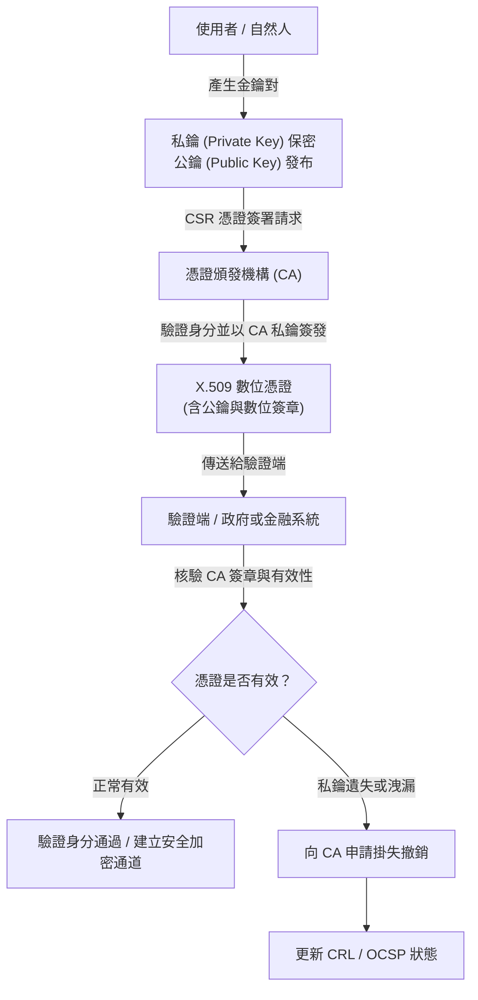

# 🛡️ SEC-04 CompTIA Security+ Lesson 04：PKI 公鑰基礎設施、數位憑證與金鑰生命週期

> **課程主題**：PKI 公鑰基礎設施架構與數位憑證生命週期管理  
> **授課講師**：授課講師（資安與網路認證原廠認證講師）  
> **核心模組**：CompTIA Security+ Domain 2: Architecture and Design (Cryptography & PKI)  
> **學習目標**：掌握公鑰/私鑰非對稱加解密原理、數位簽章防偽與自然人憑證撤銷流程  
> **關聯文件**：[📄 完整原話逐字稿 (2025-01-15-Lesson04-PKI與數位憑證-proofread.md)](./2025-01-15-Lesson04-PKI與數位憑證-proofread.md)

---

## 🏛️ 核心架構與概念流轉圖

---

## 🔬 技術精華與核心考點解析

### 數位身分與自然人憑證原理

- 自然人憑證本質是政府主管機關認可的數位身分證，內部存放私鑰與 X.509 數位憑證。
- 私鑰永遠存放在智慧卡（Smart Card）之安全晶片內，不可匯出；政府與公家機關只持有使用者的公鑰，無權亦無可能持有使用者私鑰。

### 公鑰與私鑰職責劃分

- 公鑰加密，私鑰解密：確保資料傳輸的機密性（Confidentiality）。
- 私鑰簽名，公鑰驗章：確保資料來源的真實性（Authenticity）與不可否認性（Non-repudiation）。

### 金鑰遺失與撤銷應變流程

- 若實體憑證卡片遺失或私鑰疑似洩漏，無法像傳統密碼般簡單找回，必須立即向 CA 申辦掛失。
- CA 將該憑證之序號加入憑證撤銷清冊（Certificate Revocation List, CRL）或透過 OCSP（Online Certificate Status Protocol）即時廣播失效狀態，隨後重新產生全新金鑰對與新憑證。

---

## 💡 關鍵總結與考試應對重點

1. **考試常考：公鑰與私鑰的用途區分（加密 vs. 簽章）。私鑰簽章證明身分，公鑰驗證證明未竄改。**
1. **CRL 是批次發布的黑名單，OCSP 提供即時單筆憑證狀態查詢，OCSP Stapling 可減輕 CA 伺服器負載。**
1. **私鑰絕不能外洩，一旦遺失唯一標準處置流程是『立刻撤銷（Revoke）並重新簽發』。**
