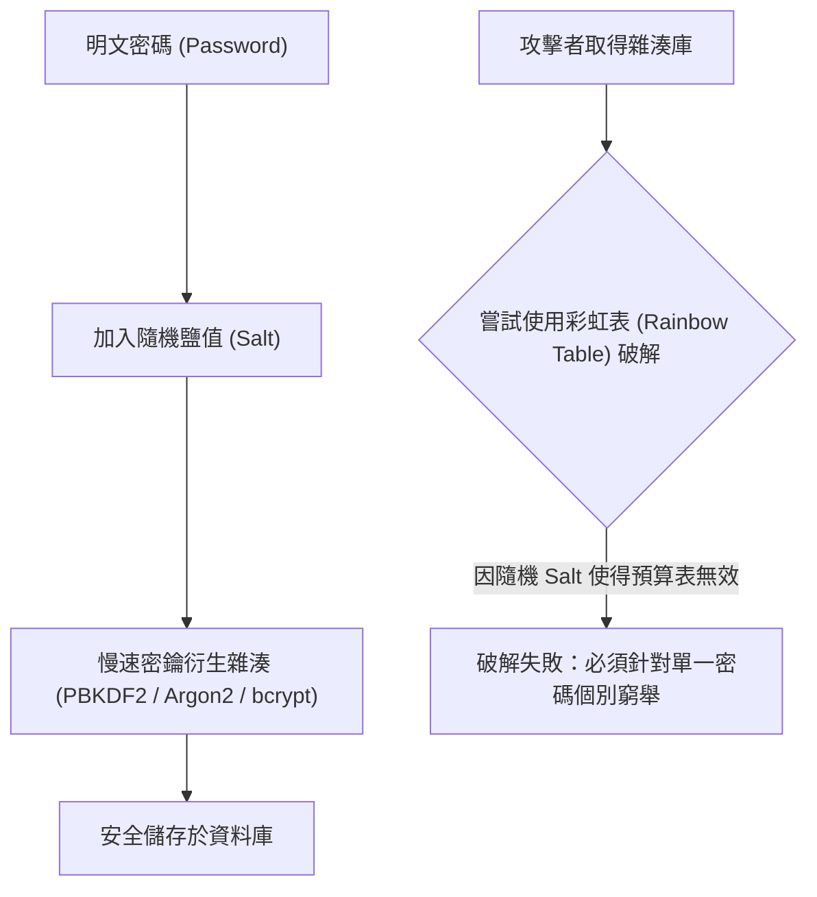

# 🛡️ SECPLUS-06-01-18 CompTIA Security+ Lesson 06 頁01~18：密碼學攻擊手法、彩虹表碰撞與降級攻擊防禦

> **課程主題**：常見密碼破解攻擊、彩虹表運作原理與演算法弱點防護  
> **授課講師**：授課講師（資安與網路認證原廠認證講師）  
> **核心模組**：CompTIA Security+ Topic 6: Cryptographic Attacks & Weaknesses  
> **學習目標**：理解線上 vs. 離線密碼攻擊、掌握 Salt+Pepper 雜湊防護與抗碰撞要求  
> **關聯文件**：[📄 完整原話逐字稿 (2025-01-16-Lesson06-01-18-密碼學攻擊手法與演算法弱點-proofread.md)](./2025-01-16-Lesson06-01-18-密碼學攻擊手法與演算法弱點-proofread.md)

---

## 🏛️ 核心架構與概念流轉圖

---

## 🔑 重點提要 (Key Takeaways)

1. **加鹽（Salting）關鍵價值**：Salt 破壞了預先計算雜湊表（Rainbow Table）的經濟效益，確保相同密碼之不同使用者擁有完全不同的雜湊值。
2. **密鑰延展函數（Key Stretching）**：使用 Argon2 或 PBKDF2 增加單次雜湊運算時間，有效遏制 GPU/ASIC 暴力破解速度。
