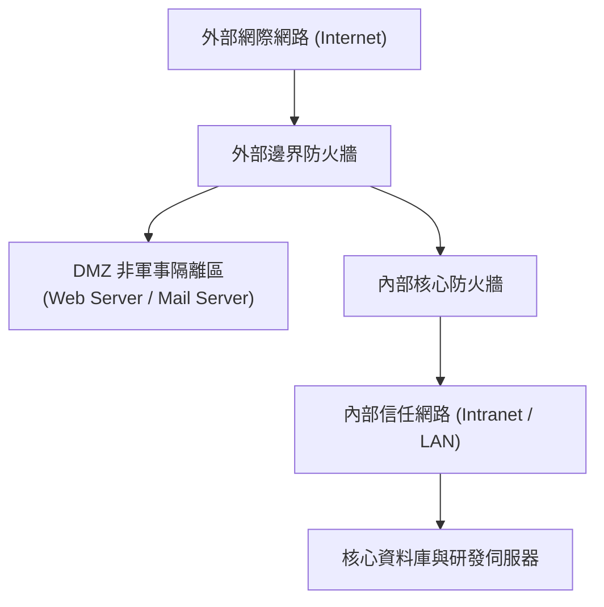

# 🛡️ SEC-05B CompTIA Security+ Lesson 05 Part 2：安全架構設計、實體與邏輯網路邊界防護

> **課程主題**：企業網路安全架構規劃與多層邊界防禦實務  
> **授課講師**：授課講師（資安與網路認證原廠認證講師）  
> **核心模組**：CompTIA Security+ Domain 2: Architecture and Design  
> **學習目標**：掌握 DMZ 隔離區規劃、內外網邊界安全與縱深防禦體系設計  
> **關聯文件**：[📄 完整原話逐字稿 (2025-01-17-Lesson05B-安全架構與邊界防護-proofread.md)](./2025-01-17-Lesson05B-安全架構與邊界防護-proofread.md)

---

## 🏛️ 核心架構與概念流轉圖

---

## 🔬 技術精華與核心考點解析

### DMZ 隔離區設計要點

- 對外公開服務（Web、Mail、DNS）必須置於 DMZ，嚴禁直接置於內部 LAN。
- 雙防火牆架構（Dual Firewall）：即使外部 Web 伺服器遭入侵提權，攻擊者仍受阻於第二道內部防火牆，無法直接刺探內部資料庫。

### 實體與邏輯安全控制

- 實體控制：機房門禁、監視器、訪客登記、機櫃上鎖與環境溫濕度監控。
- 邏輯控制：802.1Q VLAN 隔離、802.1X 網路存取控制（NAC）、ACL 與微隔離（Micro-segmentation）。

---

## 💡 關鍵總結與考試應對重點

1. **考試常考：何種伺服器適合放 DMZ？（答：需要直接接受網際網路未經身分驗證連線的服務）。**
1. **縱深防禦核心原則：任何單一控制措施（Control）失效時，不應導致整體系統全面淪陷。**
