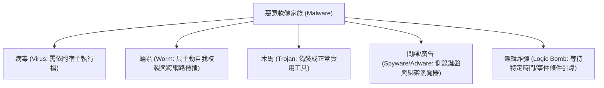

# 🛡️ SECPLUS-13-07-14 CompTIA Security+ Lesson 13 頁07~14：惡意程式分類、廣告軟體（Adware）與特洛伊木馬潛伏

> **課程主題**：惡意軟體家族分類、廣告間諜軟體誘裝與後門潛伏機制  
> **授課講師**：授課講師（資安與網路認證原廠認證講師）  
> **核心模組**：CompTIA Security+ Topic 13: Malware Classifications & Indicators  
> **學習目標**：識別病毒/蠕蟲自我複製特性、掌握木馬偽裝手法與邏輯炸彈防範  
> **關聯文件**：[📄 完整原話逐字稿 (2025-01-22-Lesson13-07-14-惡意軟體特徵與間諜廣告軟體分析-proofread.md)](./2025-01-22-Lesson13-07-14-惡意軟體特徵與間諜廣告軟體分析-proofread.md)

---

## 🏛️ 核心架構與概念流轉圖

---

## 🔑 重點提要 (Key Takeaways)

1. **病毒 vs. 蠕蟲本質差異**：病毒必須仰賴使用者點擊執行或宿主程式啟動；蠕蟲利用網路通訊協定弱點具備自主跨主機擴散能力。
2. **邏輯炸彈防禦**：多見於內部員工心懷不滿埋藏程式碼，須透過程式碼同儕審查（Peer Review）與離職停權機制防範。
