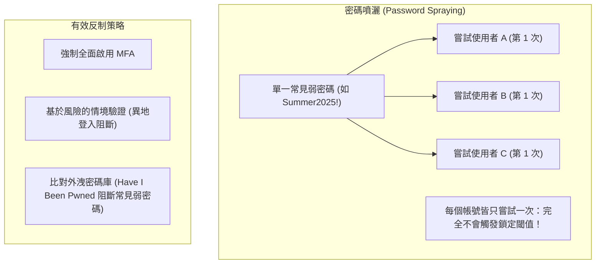

# 🛡️ SECPLUS-13-22-25 CompTIA Security+ Lesson 13 頁22~25：線上密碼破解手法、密碼噴灑（Spraying）與憑證填充防護

> **課程主題**：線上密碼攻擊手法、密碼噴灑技術與防範外洩憑證填充  
> **授課講師**：授課講師（資安與網路認證原廠認證講師）  
> **核心模組**：CompTIA Security+ Topic 13: Password Attacks & Credential Stuffing  
> **學習目標**：理解密碼噴灑如何繞過「連續錯三次鎖定」、部署 MFA 與行為驗證遏止攻擊  
> **關聯文件**：[📄 完整原話逐字稿 (2025-01-23-Lesson13-22-25-線上密碼攻擊與憑證填充防護-proofread.md)](./2025-01-23-Lesson13-22-25-線上密碼攻擊與憑證填充防護-proofread.md)

---

## 🏛️ 核心架構與概念流轉圖

---

## 🔑 重點提要 (Key Takeaways)

1. **密碼噴灑巧妙處**：傳統暴力破解是對「單一帳號嘗試千百種密碼」（立即鎖定）；密碼噴灑則是對「千百個帳號嘗試同一組常見密碼」，完美隱藏在正常登入雜訊中。
2. **憑證填充根源**：利用大眾「跨站使用同一組帳密」之壞習慣，拿暗網外洩的帳密庫自動化撞庫。
