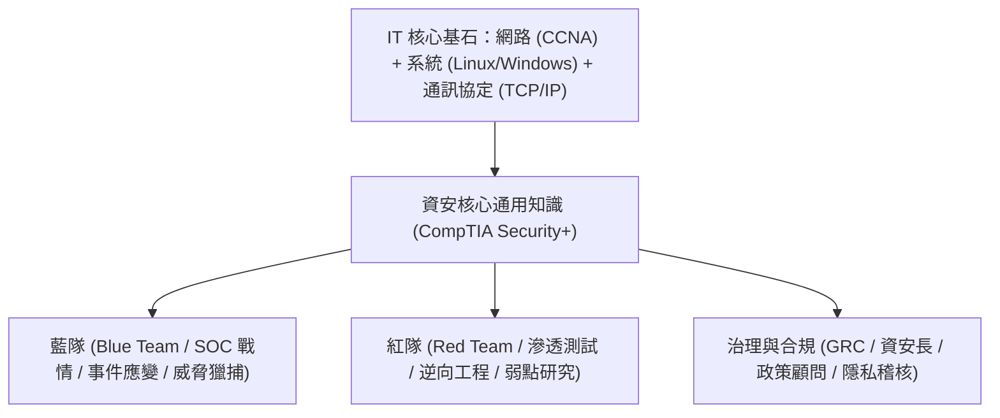

# 🛡️ SECPLUS-15-01-13 CompTIA Security+ Lesson 15 頁01~13：資安專業職涯地圖、算力發展高原與不可替代核心技能

> **課程主題**：資安專業職涯規劃、AI 發展趨勢與底層網路系統不可替代價值  
> **授課講師**：授課講師（資安與網路認證原廠認證講師）  
> **核心模組**：CompTIA Security+ Topic 15: Career Pathways & Industry Trends  
> **學習目標**：建立長遠資安技能樹、掌握紅藍隊專業分工與核心通訊底層技術  
> **關聯文件**：[📄 完整原話逐字稿 (2025-01-23-Lesson15-01-13-資安工程師職涯發展與技能高原突破-proofread.md)](./2025-01-23-Lesson15-01-13-資安工程師職涯發展與技能高原突破-proofread.md)

---

## 🏛️ 核心架構與概念流轉圖

---

## 🔑 重點提要 (Key Takeaways)

1. **底層技術永遠長青**：即使 AI 時代工具更迭劇烈，真正深刻理解作業系統核心、封包結構與交換路由的工程師永遠無法被輕易取代。
2. **T 型人才發展**：先以 Security+ 建立資安通識之廣度（橫杠），再挑選熱愛之專精領域（縱深）鑽研原廠進階證照。
