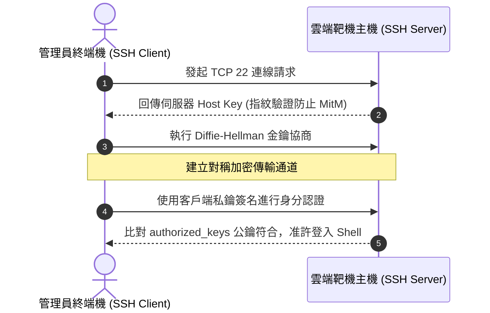

# 🛡️ SECPLUS-LAB-SSH CompTIA Security+ Lab 實機演練：SSH 遠端安全連線、原廠實驗室平台登入與金鑰認證

> **課程主題**：CompTIA 原廠雲端實驗室開通、SSH 遠端終端機連線與公私鑰身分鑑別  
> **授課講師**：授課講師（資安與網路認證原廠認證講師）  
> **核心模組**：CompTIA Security+ Hands-on Lab: SSH Remote Administration  
> **學習目標**：熟練原廠實作環境操作、配置 SSH 金鑰對（SSH Key Pairs）杜絕密碼爆破  
> **關聯文件**：[📄 完整原話逐字稿 (2025-01-24-Lab-SSH遠端靶機連線與金鑰認證實務-proofread.md)](./2025-01-24-Lab-SSH遠端靶機連線與金鑰認證實務-proofread.md)

---

## 🏛️ 核心架構與概念流轉圖

---

## 🔑 重點提要 (Key Takeaways)

1. **原廠實驗室實操價值**：CompTIA Security+ 包含實作題（PBQs），必須親自在終端機輸入指令完成配置，不可僅靠紙上談兵。
2. **禁用 SSH 密碼登入**：生產環境應全面停用 PasswordAuthentication，強制改用 Ed25519 或 RSA 4096 憑證私鑰登入。
