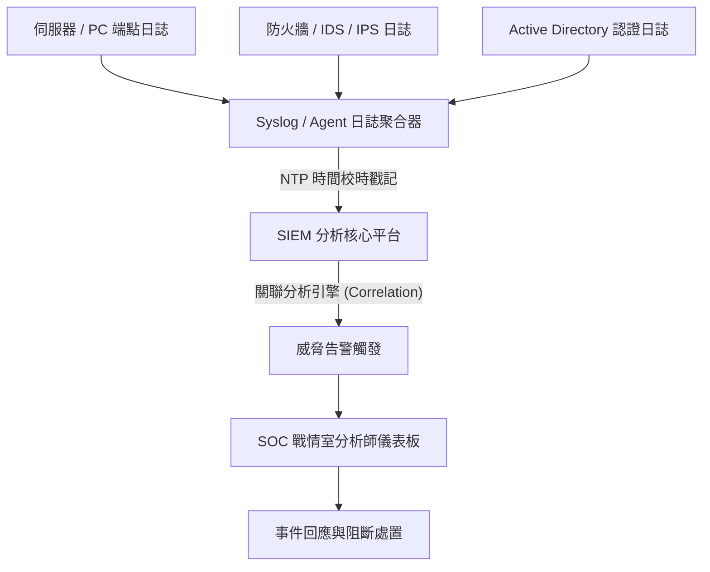

# 🛡️ SEC-12 CompTIA Security+ Lesson 12：資安日誌記錄器、SIEM 架構與 SOC 戰情室事件監控

> **課程主題**：企業級日誌聚合、SIEM 關聯分析與資安維運中心（SOC）威脅偵測實務  
> **授課講師**：授課講師（資安與網路認證原廠認證講師）  
> **核心模組**：CompTIA Security+ Domain 4: Operations and Incident Response  
> **學習目標**：掌握端點與網路日誌收集標準、SIEM 關聯規則設定與 NTP 時間同步之關鍵性  
> **關聯文件**：[📄 完整原話逐字稿 (2025-01-24-Lesson12-SIEM與SOC戰情室-proofread.md)](./2025-01-24-Lesson12-SIEM與SOC戰情室-proofread.md)

---

## 🏛️ 核心架構與概念流轉圖

---

## 🔬 技術精華與核心考點解析

### 日誌收集與時間同步（NTP）之致命重要性

- 所有日誌來源主機必須強制設定 NTP（Network Time Protocol）同步至可信時間源。
- 若日誌時鐘偏差，不同設備產生的事件時間序將錯亂，導致 SIEM 無法建立因果關聯鏈，且在法律鑑識上失去證據效力。

### SIEM 關聯分析（Correlation）價值

- 單一防火牆連線被擋可能只是日常雜訊，單一帳號密碼輸錯可能只是忘記密碼；但若『短時間內 100 次登入失敗 ＋ 隨後成功登入 ＋ 隨即觸發非辦公時間海量外送連線』，SIEM 關聯規則將立刻判定為暴力破解成功並觸發 P1 緊急警報。

---

## 💡 關鍵總結與考試應對重點

1. **考試常考：日誌鑑識與跨設備關聯分析的第一前提是什麼？（答：嚴格精準的 NTP 時間同步）。**
1. **Write Once Read Many (WORM) 儲存裝置常用於封存日誌，確保日誌具備防竄改性（Tamper-proof）。**
