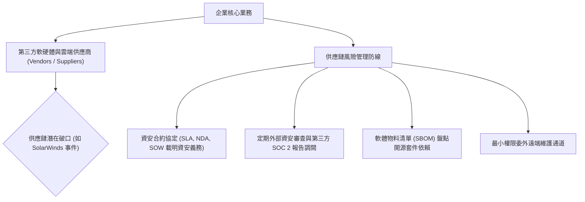

# 🛡️ SECPLUS-15-19-16-08 CompTIA Security+ Lesson 15/16：安全控制成效評估、內外部資源比例與供應鏈風險管理

> **課程主題**：安全控制評估策略、內外部資源配置與供應鏈第三方風險管理  
> **授課講師**：授課講師（資安與網路認證原廠認證講師）  
> **核心模組**：CompTIA Security+ Topic 15/16: Vendor Risk & Security Assessments  
> **學習目標**：評估企業內建 vs. 委外資安效益、建立第三方合約防護網並管控供應鏈風險  
> **關聯文件**：[📄 完整原話逐字稿 (2025-01-24-Lesson15-19-16-08-安全控制評估與第三方供應商風險-proofread.md)](./2025-01-24-Lesson15-19-16-08-安全控制評估與第三方供應商風險-proofread.md)

---

## 🏛️ 核心架構與概念流轉圖

---

## 🔑 重點提要 (Key Takeaways)

1. **軟體供應鏈風險防不勝防**：攻擊者不再直攻大企業，而是攻陷具備信任連線的下游廠商。必須落實嚴格的 Vendor Assessment。
2. **合約是最後一道防線**：在委外契約中必須明確載明資安事件之通報時效、賠償上限與稽核權利（Right to Audit）。
