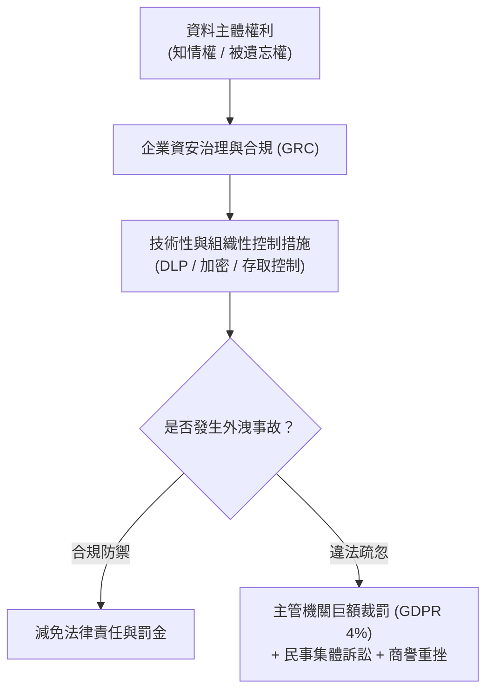

# 🛡️ SEC-16 CompTIA Security+ Lesson 16：隱私權法規、資料保護規範與認證考試須知

> **課程主題**：個人資料保護法規、企業資安合規義務與 Security+ 認證測驗全攻略  
> **授課講師**：授課講師（資安與網路認證原廠認證講師）  
> **核心模組**：CompTIA Security+ Domain 5: Governance, Risk, and Compliance (GRC) & Exam Rules  
> **學習目標**：掌握 GDPR 規範原則、資料外洩法律後果及 Security+ 實戰考試流程技巧  
> **關聯文件**：[📄 完整原話逐字稿 (2025-01-28-Lesson16-隱私法規與考試須知-proofread.md)](./2025-01-28-Lesson16-隱私法規與考試須知-proofread.md)

---

## 🏛️ 核心架構與概念流轉圖

---

## 🔬 技術精華與核心考點解析

### 隱私權侵犯的法律定義與界線

- 未經授權讀取、修改、刪除或洩漏他人個人資料，即構成隱私侵權與犯罪行為。
- 未經客戶同意擅自更動客戶資料庫內容，即便出於善意亦屬違法行為。

### 歐盟 GDPR 與國際法規遵循

- GDPR 為全球資料保護法規標竿，罰金上限高達企業全球年營業額 4% 或 2000 萬歐元（以較高者為準）。
- 核心權利包含『被遺忘權（Right to be Forgotten）』，客戶有權要求企業徹底刪除其所有個人資料。

### 資安專業人員的顧問與參謀角色

- 資安人員應扮演企業管理層的智囊與參謀，需向董事會清楚說明資料外洩帶來的法律訴訟、商譽損害與巨額財務衝擊。

### CompTIA Security+ 認證考試須知

- 測驗時間：90 分鐘，最多 90 題，滿分 900 分，通過門檻為 750 分（約 83%）。
- 題型包含單選題、多選題，以及開頭的 3-5 題實作情境拖拉模擬題（Performance-Based Questions, PBQ）。
- 建議應試策略：開頭 PBQ 若題目較長可先標記（Flag）跳過，先做完所有單選題確保基本分，最後回頭專注攻克 PBQ。

---

## 💡 關鍵總結與考試應對重點

1. **GDPR 是 Security+ 法律法規章節中最常考的標的，務必熟記 Data Controller（資料控制者）與 Data Processor（資料處理者）的差別。**
1. **考試時 PBQ 佔分比重極高，務必詳讀題目拓撲圖，每一步驟都要在虛擬介面中點擊『Apply』或『Save』確保生效。**
